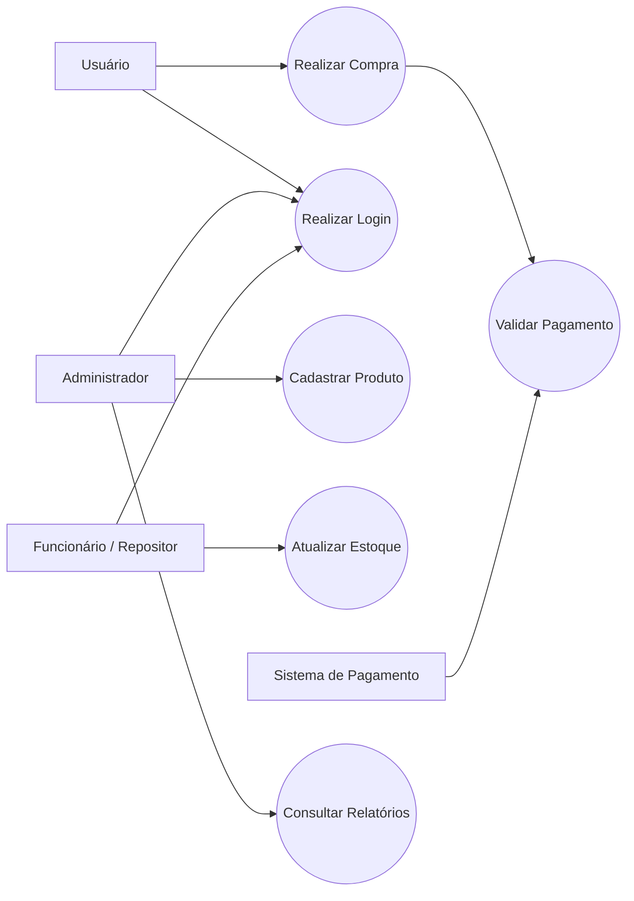
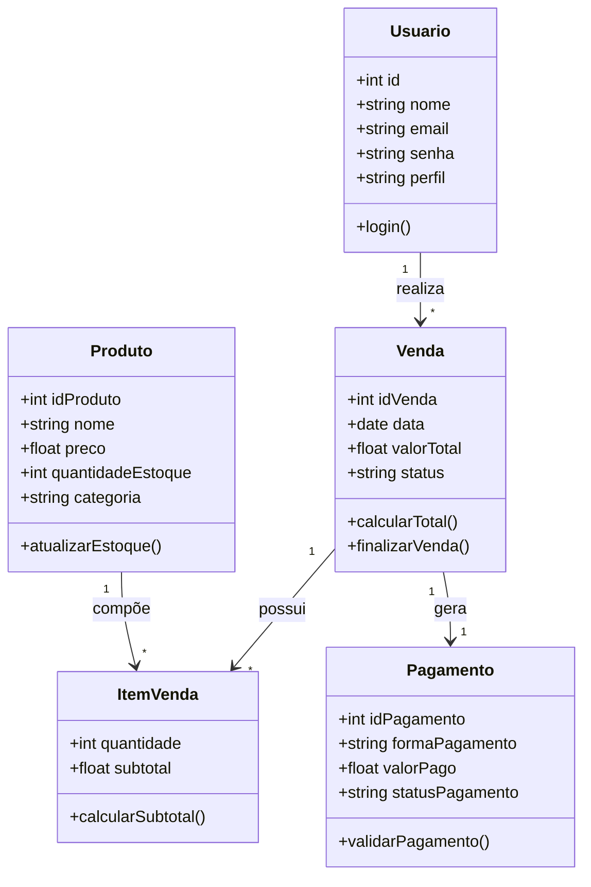
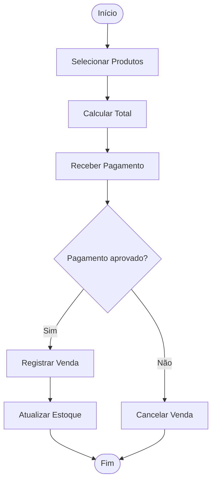
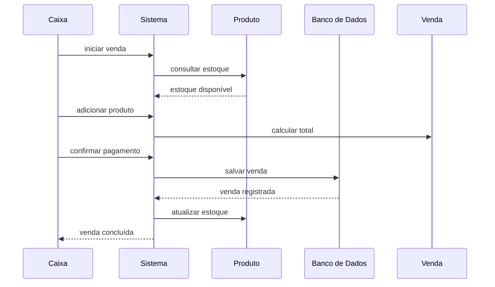
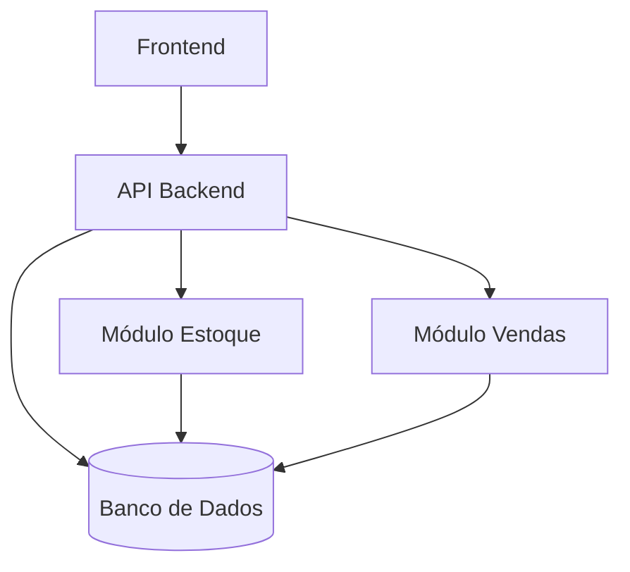
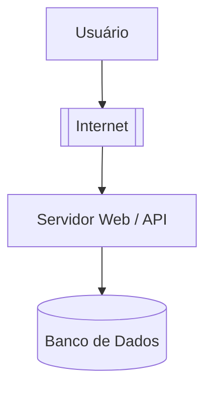

# Documento de Requisitos e Projeto de Software

---

# 1. Introdução

## 1.1 Objetivo
Descrever o desenvolvimento de um minimercado autônomo instalado no campus universitário, oferecendo itens essenciais, higiene pessoal, primeiros socorros e alimentação rápida para a comunidade acadêmica.

## 1.2 Escopo
O sistema permitirá que usuários realizem compras de forma independente através de um terminal digital de autoatendimento, utilizando leitura de código de barras e pagamentos digitais.

O sistema contempla:
- Cadastro de usuários
- Leitura de produtos
- Pagamentos digitais
- Controle de estoque
- Emissão de comprovantes digitais

Fora do escopo:
- Atendimento presencial contínuo
- Pagamentos em dinheiro
- Entregas externas

## 1.3 Definições, Acrônimos e Abreviações
- PIX: Sistema de pagamento instantâneo
- LGPD: Lei Geral de Proteção de Dados
- Self-checkout: Sistema de autoatendimento
- Totem: Terminal de autoatendimento

---

# 2. Product Vision

## 2.1 Problema
Dificuldade de acesso a itens de higiene, alimentação e primeiros socorros durante o horário de aula, principalmente no período noturno, além dos riscos de sair do campus à noite.

## 2.2 Solução
Um minimercado autônomo onde o usuário escolhe os produtos e realiza o pagamento digital sem necessidade de atendente.

## 2.3 Público-Alvo
- Estudantes universitários
- Professores
- Funcionários da instituição

## 2.4 Proposta de Valor
Oferecer praticidade, rapidez e segurança para a comunidade acadêmica dentro do campus universitário.

## 2.5 Diferencial
- Funcionamento 24 horas
- Autoatendimento
- Pagamento rápido via PIX e cartão
- Segurança para alunos do turno noturno

## 2.6 Funcionalidades principais (alto nível)
- Cadastro de usuários
- Leitura de código de barras
- Pagamento digital
- Controle de estoque
- Emissão de comprovantes

---

# 3. Visão Geral do Sistema

## 3.1 Descrição Geral
O sistema consiste em um mercadinho autônomo instalado dentro da universidade, permitindo compras rápidas de produtos essenciais através de um terminal touch screen.

## 3.2 Stakeholders
Liste os principais envolvidos:
- Usuários
- Administração da universidade
- Desenvolvedores
- Repositores de estoque

---

# 4. Requisitos Funcionais

## RF01 - Cadastro de usuários

**Descrição:**
Permitir o cadastro de usuários utilizando e-mail institucional.

**Prioridade:** Alta

**Entradas:**
- Nome
- E-mail institucional
- Senha

**Saídas:**
- Cadastro realizado com sucesso

**Regras de negócio:**
- Apenas e-mails institucionais válidos serão aceitos

---

## RF02 - Leitura de produtos

**Descrição:**
Permitir leitura de produtos por código de barras.

**Prioridade:** Alta

**Entradas:**
- Código de barras

**Saídas:**
- Nome do produto
- Valor
- Quantidade disponível

**Regras de negócio:**
- A leitura deve ocorrer em até 2 segundos

---

## RF03 - Exibição do valor total

**Descrição:**
Exibir o valor total da compra antes da finalização.

**Prioridade:** Alta

**Entradas:**
- Produtos adicionados ao carrinho

**Saídas:**
- Valor total atualizado

**Regras de negócio:**
- O valor deve atualizar automaticamente

---

## RF04 - Pagamento digital

**Descrição:**
Processar pagamentos via PIX e cartão.

**Prioridade:** Alta

**Entradas:**
- Dados da transação
- Método de pagamento

**Saídas:**
- Confirmação do pagamento

**Regras de negócio:**
- Os dados financeiros devem ser criptografados

---

## RF05 - Envio de comprovante digital

**Descrição:**
Enviar comprovante digital após a compra.

**Prioridade:** Média

**Entradas:**
- Dados da compra
- E-mail do usuário

**Saídas:**
- Comprovante enviado

**Regras de negócio:**
- O comprovante deve conter itens, data e valor total

---

# 5. Requisitos Não Funcionais

## 5.1 Usabilidade
- Interface intuitiva
- Compatibilidade com touch screen
- Botões grandes e legíveis
- Compra finalizada em até 3 etapas
- Usuário deve concluir compras rapidamente

## 5.2 Eficiência
- Leitura de produtos em menos de 2 segundos
- Consulta ao banco em até 1,5 segundos
- Suporte à sincronização automática de estoque

## 5.3 Desempenho
- Funcionamento 24 horas por dia
- Estabilidade sob carga
- Suporte a múltiplos usuários simultâneos

## 5.4 Espaço
- Uso eficiente de memória
- Sistema leve para hardware limitado
- Estoque limitado ao espaço físico disponível

## 5.5 Confiabilidade
- Disponibilidade contínua
- Recuperação de falhas
- Integridade dos dados das compras

## 5.6 Segurança (Proteção)
- Autenticação de usuários
- Criptografia de ponta a ponta
- Controle de acesso
- Conformidade com LGPD

---
## 6. Requisitos Organizacionais 

### 6.1 Ambientais 
- Sistema Operacional: O programa de rodar de forma leve, considerando que o hardware do tablet de autoatendimento possui recursos de processamento limitados. A interface deve ser compatível com operações via touch, eliminando a necessidade de teclados e mouse. O ideal seria um sistema operacional Android, visando baixo custo e fácil manutenção, além de alta compatibilidade com outros sistemas.
- Infraestrutura: A instalação física no campus da faculdade depende obrigatoriamente de um ponto de energia e de uma rede Wi-Fi estável para garantir a conectividade do tablet.
  
### 6.2 Operacionais
- Logs: O sistema deve registrar transações financeiras de forma segura, garantindo que os dados sejam criptografados e não fiquem armazenados localmente no totem para evitar vulnerabilidades físicas. Além de gerar registros digitais de todas as compras para permitir o envio automático de comprovantes aos usuários. Todas as interações com o sistema devem respeitar as normas da LGPD, garantindo a privacidade dos logs de dados cadastrais dos alunos.
- Monitoramento: É essencial o acompanhamento em tempo real do estoque. O sistema deve permitir que o repositor visualize produtos com baixo nível de unidades para garantir a eficiência do abastecimento. O sistema deve exigir autenticação para que apenas usuários registrados como RGA realizem compras, criando responsabilidade em quem acessa o minimercado.
  
### 6.3 Desenvolvimento
- Versionamento (Git): O desenvolvimento do sistema utilizará Git para controle de versão, permitindo controle das alterações no código, organização das funcionalidades e colaboração entre os desenvolvedores.
- Padrões de Código: O desenvolvimento deve priorizar a leveza do software para se adaptar a limitação de processamento no tablet. O código deve ter integrações com sistemas como o da SEFAZ para emissão de cupons fiscais, além de integração com o banco de dados da universidade.
- Testes Automatizados: Serão implementados testes automatizados para validar funcionalidades como autenticação de usuários, registro de compras, pagamentos digitais e atualização de estoque, garantindo maior confiabilidade ao sistema e identificando “Bugs” para as devidas correções

## 7. Requisitos Externos

### 7.1 Reguladores
- LGPD: O sistema deve seguir integralmente as diretrizes da Lei Geral de Proteção de Dados (LGPD),
garantindo a segurança e privacidade das informações pessoais dos alunos cadastrados. Os dados devem ser
armazenados de forma segura, com acesso restrito apenas a usuários autorizados.
- Normas Específicas: O sistema deve respeitar normas institucionais da universidade e requisitos relacionados
a sistemas de pagamento digital, emissão de comprovantes e integração com serviços externos, garantindo
conformidade operacional e legal.

### 7.2 Éticos
- Não Discriminação: O sistema deve garantir igualdade de acesso a todos os usuários, sem qualquer tipo de
discriminação relacionada a curso, gênero, condição social ou necessidades especiais, promovendo
acessibilidade e inclusão digital.
- Transparência: Todas as operações realizadas no minimercado devem ser claras ao usuário, exibindo
informações corretas sobre preços, estoque, pagamentos e registros de compras, assegurando confiança e
credibilidade no sistema.

### 7.3 Legais
- Leis: O sistema deve atender às legislações brasileiras aplicáveis ao comércio digital e armazenamento de
dados, incluindo normas fiscais para emissão de comprovantes e regulamentações relacionadas ao tratamento
de informações pessoais e financeiras.

### 7.4 Segurança Externa
- Proteção contra Ataques: O sistema deve possuir mecanismos de proteção contra invasões, vazamento de
dados e acessos não autorizados, utilizando autenticação segura, criptografia e monitoramento de atividades
suspeitas.
- Auditorias: Devem ser realizados processos de auditoria e verificação periódica no sistema para garantir
integridade das informações, confiabilidade das transações financeiras e conformidade com padrões de
segurança.

### 7.5 Contábeis
- Registro de Transações: O sistema deve manter registros detalhados de todas as compras e pagamentos
realizados no minimercado, permitindo rastreamento completo das movimentações financeiras.
- Relatórios: O sistema deve gerar relatórios financeiros e operacionais para auxiliar o controle administrativo do
estoque, faturamento e fluxo de vendas, facilitando análises e tomadas de decisão pela gestão do minimercado.

##  8. Arquitetura do Sistema

### 8.1 Visão Geral
A arquitetura do sistema será baseada em um modelo cliente-servidor monolítico, composto por uma aplicação de front-end para interação dos usuários, um back-end responsável pelas regras de negócio e integração com serviços externos, e um banco de dados para armazenamento das informações.

### 8.2 Componentes
- Front-end:
  - Exibir o catálogo de produtos, gerar o QR Code de pagamento e dar o feedback de "compra finalizada". 
- Backend
  - Servidor: Node.js ou Python, que processa os pedidos e valida as transações financeiras.
  - Integração: API de Pagamento para confirmar o recebimento do dinheiro em tempo real.
- Banco de dados
  - Banco de Dados: PostgreSQL ou MongoDB, para registrar as vendas e controlar o que ainda tem na prateleira (estoque).
- APIs externas
  - API de pagamento (PIX e cartão);
  - Sistema de emissão de comprovantes fiscais;
  - Banco de dados institucional para validação de e-mails acadêmicos.
  
### 8.3 Tecnologias
- Linguagem
  - JavaScript/TypeScript (Front-end e Back-end com Node.js)
  - Python (alternativa para Back-end)  
- Framework
  - React ou Flutter, para criar uma tela rápida e visual que funcione tanto em totens quanto no celular.  
  
### 8.4 Decisões Arquiteturais
Explique como a arquitetura atende aos requisitos não funcionais:
- Desempenho
  - A arquitetura cliente-servidor reduz o processamento no tablet e garante respostas rápidas para consultas, estoque e pagamentos.  
- Segurança
  - O sistema utilizará HTTPS, criptografia de dados e autenticação de usuários, seguindo as diretrizes da LGPD.
- Escalabilidade  
  - A solução permite futuras expansões, como novos pontos de venda, aplicativo móvel e integrações com outros sistemas.
---

# 9. Casos de Uso e Diagramas UML
Esta seção representa visualmente e descritivamente o funcionamento do sistema Mini Mercado Autônomo. Os diagramas UML auxiliam na compreensão das funcionalidades do sistema, dos atores envolvidos, dos fluxos de operação e da estrutura principal da aplicação.

Os principais atores do sistema são:

**Usuário:** pessoa que realiza compras no Mini Mercado Autônomo;
**Administrador:** responsável pelo cadastro de produtos, consulta de relatórios e gerenciamento geral do sistema;
**Funcionário/Repositor:** responsável por atualizar e repor o estoque;
**Sistema de Pagamento:** serviço externo responsável por validar pagamentos digitais.

---

## 9.1 Casos de Uso

Os casos de uso representam as principais interações entre os usuários e o sistema Mini Mercado.

---
## UC01 - Realizar Login

**Ator:** Usuário / Administrador / Funcionário

**Descrição:**
Permite que o usuário autenticado acesse o sistema do Mini Mercado Autônomo utilizando usuário e senha válidos.

---

### Fluxo principal

1. Usuário acessa a tela de login
2. Usuário informa usuário e senha
3. Sistema valida os dados informados
4. O sistema concede acesso ao painel correspondente ao perfil do usuário

---

### Fluxo alternativo

- Usuário ou senha inválidos
- Conta bloqueada
- Usuário sem permissão de acesso

---

## UC02 - Cadastrar Produto

**Ator:** Administrador

**Descrição:**
Permite que o administrador cadastre novos produtos no sistema do Mini Mercado, informando os dados necessários para controle de estoque e vendas.

---

### Fluxo principal

1. Administrador acessa o painel de produtos
2. Administrador seleciona a opção de cadastrar novo produto
3. Administrador informa nome, preço, categoria e quantidade em estoque
4. Sistema valida os dados informados
5. Sistema cadastra o produto no banco de dados
6. Sistema confirma que o produto foi cadastrado com sucesso

---

### Fluxo alternativo

- Dados obrigatórios não preenchidos
- Produto já cadastrado
- Erro ao salvar as informações no banco de dados

---

## UC03 - Atualizar Estoque

**Ator:** Funcionário / Repositor

**Descrição:**
Permite que o funcionário atualize a quantidade de produtos disponíveis no estoque, adicionando ou removendo unidades conforme a necessidade.

---

### Fluxo principal

1. Funcionário acessa o módulo de estoque
2. Funcionário seleciona o produto desejado
3. Funcionário informa a quantidade a ser adicionada ou removida
4. Sistema verifica os dados informados
5. Sistema atualiza a quantidade do produto no estoque
6. Sistema confirma a atualização do estoque

---

### Fluxo alternativo

- Produto não encontrado
- Quantidade inválida
- Estoque insuficiente para remoção
- Erro ao atualizar as informações no sistema

---

## UC04 - Registrar Venda

**Ator:** Usuário

**Descrição:**
Permite que o usuário realize uma compra de forma autônoma, sem a necessidade de um caixa, utilizando o sistema de autoatendimento do Mini Mercado.

---

### Fluxo principal

1. Usuário inicia uma nova compra no sistema
2. Usuário seleciona ou registra os produtos desejados
3. Sistema consulta a disponibilidade dos produtos no estoque
4. Sistema calcula o valor total da compra
5. Usuário escolhe a forma de pagamento
6. Sistema envia os dados para validação do pagamento
7. Sistema confirma o pagamento aprovado
8. Sistema registra a venda no banco de dados
9. Sistema atualiza o estoque automaticamente
10. O sistema informa que a compra foi concluída

---

### Fluxo alternativo

- Produto sem estoque
- Produto não encontrado
- Pagamento não aprovado
- Compra cancelada pelo usuário
---

## UC05 - Consultar Relatórios

**Ator:** Administrador

**Descrição:**
Permite que o administrador consulte relatórios de vendas e estoque para acompanhar o funcionamento e o desempenho do Mini Mercado.

---

### Fluxo principal

1. Administrador acessa o módulo de relatórios
2. Administrador seleciona o tipo de relatório desejado
3. Sistema consulta os dados no banco de dados
4. Sistema organiza as informações de vendas e estoque
5. Sistema exibe o relatório na tela

---

### Fluxo alternativo

- Nenhum dado encontrado
- Erro na geração do relatório
- Usuário sem permissão para acessar os relatórios

---
## UC06 - Validar Pagamento

**Ator:** Sistema de Pagamento

**Descrição:**
Permite que o sistema externo de pagamento valide a transação realizada pelo usuário durante a compra.

---

## Fluxo principal
1. Sistema envia os dados da transação para o sistema de pagamento
2. Sistema de pagamento analisa a transação
3. Sistema de pagamento retorna a confirmação do pagamento
4. Sistema libera a finalização da compra
   
---

## Fluxo alternativo
- Pagamento recusado
- Falha de comunicação com o sistema de pagamento
- Tempo de resposta excedido
  
---

## Diagrama de Caso de Uso

---
### 9.2 Diagrama de Classes (UML)

O diagrama de classes representa a estrutura principal do sistema, mostrando as entidades, seus atributos e os relacionamentos entre elas.

O sistema possui as seguintes classes principais:
**Usuario:** representa os usuários que acessam o sistema;
**Venda:** representa uma venda realizada;
**ItemVenda:** representa os produtos inseridos em uma venda;
**Produto:** representa os produtos cadastrados no estoque;
**Pagamento:** representa o pagamento digital realizado pelo usuário.

---

### Diagrama de Classes UML

---

## 9.3 Diagrama de Atividades (UML)

Representa o fluxo de execução do processo de venda no sistema.

---

### Exemplo

---

## 9.4 Diagrama de Sequência (UML)

Representa a comunicação entre os objetos ao longo do tempo durante o processo de venda.

---

### Exemplo

---
## 9.5 Diagrama de Componentes

O diagrama de componentes apresenta os módulos principais do sistema Mini Mercado e como eles se relacionam.

O sistema é composto por:

- **Frontend:** interface utilizada pelos usuários;
- **API Backend:** responsável pelo processamento das regras de negócio;
- **Banco de Dados:** armazena usuários, produtos, vendas e estoque;
- **Módulo Estoque:** gerencia entrada e saída de produtos;
- **Módulo Vendas:** registra vendas e calcula valores.

---

## 9.6 Diagrama de Implantação Deployment

O diagrama de implantação representa onde o sistema será executado e como os elementos se comunicam.

Neste sistema, o usuário acessa a aplicação pela internet, que se comunica com o servidor web/API. O servidor, por sua vez, acessa o banco de dados para consultar e armazenar informações de usuários, produtos, vendas e estoque.

---

##  10. Plano de Testes

### 10.1 Estratégia de Teste
O sistema será testado em diferentes níveis para garantir o correto funcionamento das funcionalidades do minimercado. Inicialmente serão realizados testes unitários nos módulos individuais, como cadastro de usuários, leitura de produtos, cálculo do valor total e processamento de pagamento. Em seguida, serão realizados testes de integração para verificar a comunicação entre o sistema de self-checkout e o sistema administrador. Posteriormente, serão executados testes de sistema para validar o funcionamento completo da aplicação e, por fim, testes de aceitação com usuários finais para confirmar se o sistema atende às necessidades estabelecidas nos requisitos.

### 10.2 Tipos de Teste
- Unitário: Testa individualmente cada funcionalidade do sistema, como validação de e-mail institucional, leitura de código de barras, cálculo do valor total e envio de comprovante.
- Integração: Verifica a comunicação entre os módulos do sistema, como a sincronização dos produtos entre o self-checkout e o sistema administrador, atualização do estoque e confirmação de pagamentos.
- Sistema: Avalia o sistema completo em ambiente de testes, garantindo que todas as funcionalidades funcionem em conjunto conforme os requisitos definidos.  
- Aceitação: Realizado com usuários finais para validar a usabilidade do sistema e confirmar se o processo de compra ocorre corretamente, desde o cadastro até o recebimento do comprovante digital. 

### 10.3 Casos de Teste
#### CT01 – Cadastro de usuário com e-mail institucional válido  
**Requisito relacionado:** RF01  
**Descrição:** Verificar se o sistema realiza o cadastro de usuários utilizando um e-mail institucional válido.  
**Entrada:**  
Nome: João Silva  
E-mail: joao@instituicao.edu.br  
Senha: 123456  
**Resultado esperado:** O sistema deve cadastrar o usuário com sucesso e exibir uma mensagem de confirmação.  

#### CT02 – Leitura de produto por código de barras  
**Requisito relacionado:** RF02  
**Descrição:** Verificar se o sistema identifica corretamente um produto por meio do código de barras dentro do tempo máximo permitido.  
**Entrada:**  
Código de barras do produto cadastrado.  
**Resultado esperado:** O sistema deve exibir o nome do produto, valor e quantidade disponível em até 2 segundos.  

#### CT03 – Atualização automática do valor total da compra  
**Requisito relacionado:** RF03  
**Descrição:** Verificar se o valor total da compra é atualizado automaticamente conforme novos produtos são adicionados ao carrinho.  
**Entrada:**  
Adição de produtos ao carrinho de compras.  
**Resultado esperado:** O sistema deve recalcular e exibir automaticamente o novo valor total da compra.  

#### CT04 – Processamento de pagamento digital  
**Requisito relacionado:** RF04  
**Descrição:** Verificar se o sistema processa corretamente pagamentos via PIX ou cartão garantindo a segurança dos dados.  
**Entrada:**  
Dados da transação.  
Método de pagamento selecionado (PIX ou cartão).  
**Resultado esperado:** O pagamento deve ser processado com sucesso, retornando uma confirmação da transação e mantendo os dados financeiros protegidos por criptografia.  

#### CT05 – Envio de comprovante digital  
**Requisito relacionado:** RF05  
**Descrição:** Verificar se o sistema envia corretamente o comprovante digital após a conclusão da compra.  
**Entrada:**  
Dados da compra realizada.  
E-mail do usuário.  
**Resultado esperado:** O usuário deve receber um comprovante digital contendo os produtos comprados, data da transação e valor total da compra.  

---

### 10.4 Testes de Requisitos Não Funcionais
- Usabilidade: Avaliar a facilidade de utilização da interface do self-checkout e do sistema administrador, verificando clareza dos comandos, tempo de aprendizado e recursos de acessibilidade.
- Eficiência: Verificar se o sistema mantém um bom tempo de resposta e suporta diversos usuários realizando compras ao mesmo tempo.
- Desempenho: Testar o funcionamento do sistema sob carga elevada, garantindo que não ocorram falhas ou travamentos durante períodos de maior utilização.
- Espaço: Validar se o sistema utiliza os recursos de armazenamento e memória de forma eficiente, evitando consumo excessivo e garantindo o armazenamento adequado dos dados de usuários, produtos e transações.
- Confiabilidade: Verificar a disponibilidade do sistema, a recuperação em caso de falhas e a integridade dos dados após interrupções ou erros inesperados.
- Segurança (Proteção): Testar os mecanismos de autenticação de usuários, criptografia de dados financeiros, validação de acessos e permissões entre usuários e administradores do sistema.

---

##  11. Critérios de Aceitação

Esta seção define as condições obrigatórias que o sistema do minimercado autônomo deve atender para ser considerado concluído, validado e pronto para implantação no campus universitário.

### 11.1 Critérios por Requisitos Funcionais (Condições de Sucesso)

* **CA01 – Cadastro de Usuários:**
  * O sistema só deve consolidar o cadastro se o e-mail inserido possuir o domínio institucional da universidade.
  * As senhas cadastradas devem ser salvas de forma segura (com hash/criptografia) no banco de dados.
  * **Condição de Sucesso:** Exibição imediata da mensagem "Cadastro realizado com sucesso" e liberação do primeiro login apenas para e-mails válidos.

* **CA02 – Leitura de Produtos:**
  * O leitor de código de barras deve ser capaz de bipar e identificar qualquer produto previamente cadastrado no banco de dados.
  * **Condição de Sucesso:** O totem deve renderizar na tela o nome correto do produto, o valor unitário e a validação de que há estoque disponível em um tempo máximo de 2 segundos após o bipe.

* **CA03 – Exibição e Atualização do Valor Total:**
  * A cada produto bipado ou removido da lista atual, o carrinho de compras deve recalcular a soma dos itens imediatamente.
  * **Condição de Sucesso:** O valor total da compra deve ser atualizado na interface de forma reativa, sem a necessidade de o usuário clicar em botões de atualizar ou recalcular.

* **CA04 – Processamento de Pagamento Digital:**
  * O sistema deve gerar um QR Code PIX dinâmico ou processar a API do cartão de crédito de forma segura.
  * **Condição de Sucesso:** A compra só é considerada "Aprovada" e a tela de feedback liberada após o retorno positivo em tempo real da API de pagamento externa. Dados de cartão ou dados bancários sensíveis nunca devem ser armazenados localmente no totem.

* **CA05 – Envio de Comprovante Digital:**
  * O sistema deve disparar um e-mail contendo a lista de itens, quantidades, valores unitários, data, hora e o valor total pago.
  * **Condição de Sucesso:** O e-mail deve ser entregue na caixa de entrada institucional do usuário que realizou a compra em até 5 minutos após a confirmação do pagamento.

---

### 11.2 Métricas de Desempenho e Eficiência

Para que o software seja aceito no hardware limitado do tablet, ele deve respeitar rigorosamente as seguintes métricas técnicas estabelecidas:

* **Tempo de Resposta da Leitura:** O tempo entre o bipe do código de barras e a exibição do produto na tela deve ser de no máximo 2 segundos. A validação será feita por meio de testes automatizados simulando a leitura.
* **Consulta ao Banco de Dados:** O tempo máximo para o processamento de consultas e requisições na API do Backend deve ser de 1,5 segundos, verificado através do monitoramento de logs do servidor.
* **Disponibilidade do Sistema:** O sistema deve permanecer operacional 24 horas por dia, 7 dias por semana. A validação ocorrerá através de testes de estresse e monitoramento de uptime em ambiente de homologação.
* **Agilidade no Fluxo de Compra:** O usuário deve ser capaz de concluir o processo de compra em no máximo 3 etapas (bipar produtos, escolher pagamento e pagar/finalizar), validado por testes de usabilidade na interface touch.

---

### 11.3 Critérios de Homologação Geral (Segurança e Operação)

* **Conformidade com a LGPD:** O sistema deve disponibilizar um termo de consentimento de uso de dados no primeiro login. Os logs gerados não devem expor dados pessoais ou financeiros abertamente no banco de dados.
* **Interface e Usabilidade Touch:** A interface deve ser homologada diretamente no tablet de autoatendimento alvo. O sistema será recusado se houver elementos pequenos que exijam mouse ou que quebrem a resolução nativa do aparelho.
* **Controle de Estoque e Sincronização:** Ao finalizar uma compra com sucesso, a quantidade do produto adquirida deve ser subtraída do banco de dados imediatamente, atualizando o painel do repositor em tempo real para evitar que um produto esgotado fisicamente continue listado como disponível.
---

##  12. Restrições

- Tecnológicas
  - Dependência de conexão com a internet para pagamentos, validação de usuários e atualização do estoque.
  - Necessidade de funcionamento em hardware com processamento limitado(tablet).
  - Integração obrigatória com APIs externas de pagamento e banco de dados institucional.    
- Legais
  - Conformidade com a LGPD para tratamento e armazenamento de dados dos usuários.
  - Conformidade com as normas fiscais para emissão de comprovantes e registros financeiros.
  - Cumprimento de licitação instipulada pela intituição.  
- De prazo
  - O desenvolvimento deve ser concluído dentro do semestre do projeto.  

---

##  13. Premissas

- Usuário terá acesso à internet.  
- Sistema será usado em dispositivos móveis.
- Os usuários utilizarão matrícula institucional válida para cadastro.
- universidade fornecerá infraestrutura adequada de energia e rede Wi-Fi.
- Haverão serviços externos para pagamento e validação.  

---

##  14. Observações Finais
O desenvolvimento deste minimercado autônomo busca oferecer uma solução prática para atender as necessidades da comunidade acadêmica, disponibilizando produtos de convêniencia de forma rápida e segura dentro do campus. O projeot reduz a necessidade de deslocamentos, especialmente durante o período noturno, aumentando a comodidade e a segurança dos usuários.

O sistema foi planejado para ser simples de utilizar, permitindo que qualquer pessoa realize compras pelo processo de autoatendimento. Recursos como controle de estoque, pagamentos digitais e emissão de comprovantes contribuem para uma gestão mais eficiente do negócio. Concluindo, este projeto utiliza dos fundamentos de Engenharia de Software para entregar uma solução prática para uma questão real da comunidade, de forma autônoma, segura e prática.
