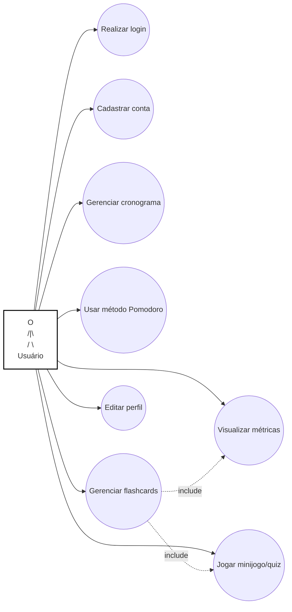
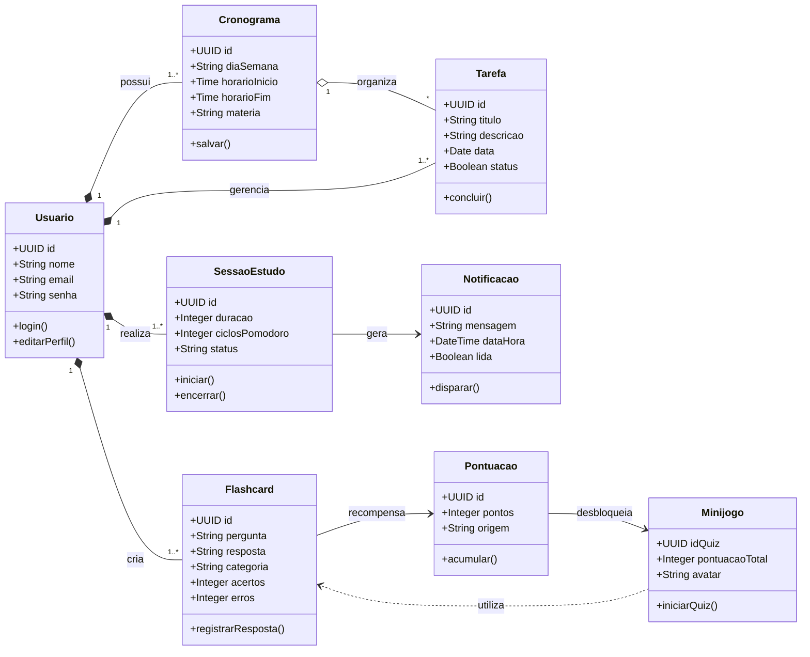
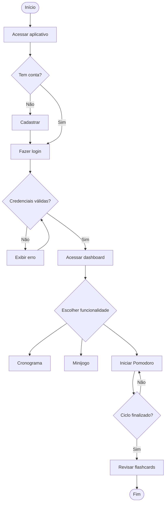
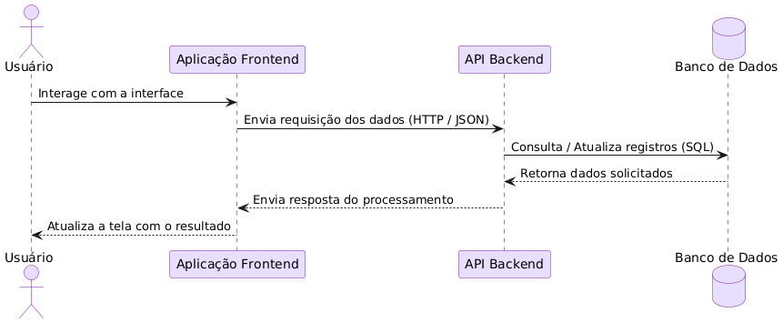
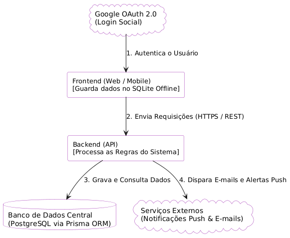
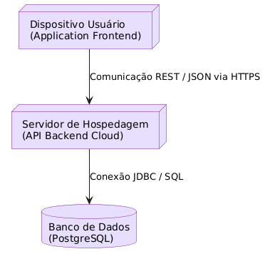

#  Documento de Requisitos e Projeto de Software

---

##  1. Introdução

### 1.1 Objetivo

Este documento tem como objetivo apresentar a visão geral do produto CromStudy, descrevendo o problema identificado, os usuários-alvo, a solução proposta e as funcionalidades planejadas. Ele serve como referência para a equipe de desenvolvimento, garantindo o alinhamento entre os membros ao longo de todas as etapas do projeto.

O CromStudy tem como objetivo auxiliar estudantes do Ensino Médio e vestibulandos na organização de sua rotina de estudos, promovendo foco, constância e eficiência no aprendizado por meio de ferramentas integradas de planejamento, revisão e gamificação.

### 1.2 Escopo

O CromStudy é um aplicativo voltado para estudantes do Ensino Médio e vestibulandos que necessitam de estrutura e organização em sua rotina acadêmica, disponível nas versões mobile e web (notebooks e desktops). O sistema oferece as seguintes funcionalidades:

### Dentro do escopo do sistema:

- Agenda e Cronograma - Planejamento de tarefas diárias, semanais e mensais com visualização em checklist.

- Método Pomodoro - Temporizador de estudo com ciclos de 25 minutos de foco e 5 minutos de intervalo.

- Flashcards - Criação de cartões de memorização com registro de acertos e erros.

- Métricas de Estudo - Relatórios de desempenho com base no tempo estudado e no aproveitamento nos flashcards.

- Sistema de Alertas - Notificações e alertas sonoros para revisões, tarefas e ciclos do Pomodoro.

- Minijogo - Quiz baseado nos flashcards do usuário com recompensas para construção de um mundo virtual.

### Fora do escopo do sistema:

- Integração com plataformas educacionais externas (ex: Google Classroom, Moodle).

- Comunicação ou colaboração em tempo real entre usuários.

- Geração automática de conteúdo de estudo ou questões por inteligência artificial.

- Funcionalidades de pagamento ou assinatura premium.

- Suporte a usuários do Ensino Fundamental ou Ensino Superior..

### 1.3 Definições, Acrônimos e Abreviações

- **CromStudy** - Nome do aplicativo mobile de organização de estudos desenvolvido pelo Grupo 06.

- **Pomodoro** - Técnica de gestão de tempo que alterna ciclos de foco (25 min) e intervalos curtos (5 min).

- **Flashcard** - Cartão de memorização com uma pergunta na frente e a resposta no verso, usado para revisão ativa de conteúdo.

- **Checklist** - Lista de tarefas com caixas de seleção que podem ser marcadas conforme concluídas.

- **Minijogo** - Funcionalidade de gamificação do Fostudy baseada em quiz com recompensas virtuais.

- **Quiz** -  Conjunto de perguntas e respostas geradas a partir dos flashcards criados pelo usuário.

- **Avatar** - Personagem virtual personalizável pelo usuário dentro do minijogo do Fostudy.

- **Métrica** - Indicador de desempenho calculado com base no tempo de estudo e resultados dos flashcards.

- **Alerta** - Notificação sonora ou visual enviada ao usuário pelo sistema em momentos definidos.

- **Feedback** - Retorno de resposta ou avaliação ao usuário relacionado com os conteúdos com mais erros no quiz, indicando quais conteúdos devem ser priorizados e estudados com mais frequência. 

- **Escalabilidade** - Capacidade do aplicativo manter bom desempenho à medida que haja acréscimo de novas funções e aumento de usuários.

- **Backend** - Área não acessada e visível para o usuário, como: códigos, documentação sobre o aplicativo, sistema de segurança, banco de dados.

- **30 FPS (Frames Per Second ou Quadros Por Segundo)** - Quantidade de imagens exibidas por segundo para criar ilusão de movimento. 

- **Android 8+ e iOS 13+** - Versões mínimas dos sistemas operacionais Android e iOS com capacidade de suportar aplicativos e funções mais exigentes, não suportadas por versões inferiores.

- **APK** (Android Package Kit ou Pacote de Aplicativo Android) - Formato de aplicativo (app) usado para instalação de app em dispositivos Android.

- **IPA** (iPhone Application ou Aplicativo para iPhone) -  Formato de aplicativo usado para a instalação de app em dispositivos iOS.

- **WCAG** (Web Content Accessibility Guidelines ou Diretrizes de Acessibilidade para Conteúdo Web) - Diretrizes para tornar conteúdos digitais acessíveis para pessoas com deficiência.

- **Criptografia** - Prática de transformar informações legíveis em formato ilegível a fim de proteger dados e informações contra roubos, alteração e acesso não autorizado. 

- **Hash** - Um dos métodos usados para criptografar dados, transformando-os em um código de tamanho fixo.

- **LGPD** (Lei Geral de Proteção de Dados) - Lei brasileira que obriga órgãos e empresas a protegerem os dados e informações de seus usuários contra vazamento e roubo.

---

##  2. Product Vision

### 2.1 Problema
Muitos estudantes enfrentam dificuldades na organização de suas rotinas de estudos, como definir horários, manter a constância e revisar conteúdos de forma eficiente. Essa falta de organização pode levar a perda de foco, desorganização e baixo rendimento nos estudos.

### 2.2 Solução
O CromStudy é um aplicativo que visa ajudar principalmente na organização e foco dos estudantes durante o processo de estudos. Para isso, é disponibilizado algumas funções: agenda, cronograma, Flashcards, Método Pomodoro, métrica de estudos, sistema de alerta e mini game. 

### 2.3 Público-Alvo
O público-alvo é composto por estudantes do ensino médio e vestibulandos do ENEM que necessitam de estrutura e organização no ambiente acadêmico para atingir metas escolares de maneira eficiente e prática.

### 2.4 Proposta de Valor
O sistema é importante porque auxilia estudantes a organizarem melhor seu tempo e manterem uma rotina de estudos mais eficiente e produtiva. Dessa forma, o aplicativo busca centralizar ferramentas essenciais de planejamento, controle e motivação em uma única plataforma, facilitando o gerenciamento dos estudos.

### 2.5 Diferencial
O principal diferencial está na integração de múltiplas funcionalidades em uma única aplicação, combinando agenda, cronograma, métricas de desempenho, flashcards, sistemas de alertas e elementos de gamificação por meio de um mini game educativo. Essa abordagem proporciona uma experiência mais dinâmica e motivadora, incentivando a criação de hábitos de estudos consistentes e melhorando o egajamento de usuário durante o processo de aprendizagem.

### 2.6 Funcionalidades principais (alto nível)
**01 - Agenda**

Estará disponível uma agenda para a verificação de datas, a fim de ajudar o usuário no momento de criação de seu cronograma e melhor visualização de datas e tarefas de maneira micro e macro. Com isso, será possível verificar dias, semanas, meses e ano. 

**02 - Cronograma**

Em cada dia da semana, a pessoa incluirá as tarefas a serem executadas e concluídas ao longo da semana e dia. Após a inclusão, as atividades diárias serão organizadas em formato de cheklist, que poderão ser marcadas, por causa das caixas de seleção, assim que as tarefas forem concluídas. 

**03 - Método Pomodoro**

O Método Pomodoro visa a definição de tempo para o processo de estudo e intervalo. Para auxiliar o estudante, o software indicará um tempo corrido de 25min para o estudo de um conteúdo e, após a finalização desse tempo, um tempo de 5mim de intervalo é iniciado. Com a finalização do intervalo, é ativado novamente o tempo de 25min, assim sucessivamente até que o conteúdo seja completamente estudado ou seu tempo total diário seja atingido. Por exemplo, a pessoa estabecele um total de 2h para estudar um conteúdo específico, ou seja, uma das tarefas inseridas no cronograma. Esse tempo de 2h será fracionado em 25min, sem contar o tempo de intervalo. Além disso, ao clicar na atividade a ser realizada no momento, o Método Pomodoro enviará uma mensagem sugerindo um tempo de estudo, com a intenção de não haver demora, o que contribui para a procrastinação e desistência.

**04 - Flashcards**

Para ajudar na revisão e aprendizagem dos conteúdos, será possível a criação de flashcards, um método de estudo que consiste na formação de uma pergunta em um card e a reposta no verso desse card. O estudante deverá responder a pergunta antes de verificar a resposta no verso no card. Após responder e verificar, o usuário deverá marcar uma das opções que aparecer "Acertei" ou "Errei". 

**05 - Métrica de estudo**

Baseado no tempo de estudo e quantidade de erros e acertos dos flashcards, um relatório será criado, com o objetivo de mostrar a evolução do usuário ao longo dos estudos. Referente a quantidade de acertos e erros dos Flashcards, o software indicará ao usuário quais conteúdos devem ser revisados com mais frequência ( conteúdos com mais erros) e  quais podem ter revisões espaçadas (conteúdos com mais acertos).

**06 - Sistema de alerta**

O sistema de alerta será incluído com o objetivo de enviar notificações relacionadas às revisões aos estudantes e às atividades inseridas no cronograma a serem estudadas no dia determinado. Isto é, quando o usuário criar seu cronograma, ele definirá um horário para que seja lembrado sobre seus afazeres do dia, além de receber um lembrete para as revisões agendadas. Também, ao término do tempo de estudo (aplicação do Método Pomodoro), o usuário receberá alertas sonoros  sobre a finalização do tempo de estudo e intervalo e, início do tempo de intervalo. 

**07 - Game**

Será incluído um mini game ao aplicativo CromStudy. Esse jogo tem relação com um mundo vazio com avatares a ser construído desde o início pelo próprio usuário. Para isso, o estudante deverá jogar um quiz baseado nos conteúdos dos flashcards criados. Ao término do jogo, a pessoa receberá pontuações, que acumularão e serão utilizadas para desbloquear cada item para construir o mini mundo de seu avatar: casa, roupas, alimentos, pets, avatares, etc.

### 2.7 Concorrentes
Os três principais concorrentes do CromStudy são:
- Aprovado - Controle de Estudos (Sand Robot)
- Forest: Mantenha o foco (Seektech)
- Notion: notas, tarefas e IA (Notion Labs, Inc.)

---

##  3. Visão Geral do Sistema

### 3.1 Descrição Geral
O CromStudy é um aplicativo voltado para estudantes que enfrentam dificuldades na organização dos estudos, foco e baixa constância ao longo do tempo. Muitos usuários apresentam desafios no gerenciamento de tarefas, na realização de revisões eficientes e na manutenção da disciplina, o que impacta diretamente seu desempenho acadêmico.

Com o objetivo de mitigar esses problemas, o CromStudy oferece uma plataforma integrada que reúne funcionalidades como agenda, cronograma de estudos, método Pomodoro, flashcards, métricas de desempenho, sistema de alertas e elementos de gamificação. Essas ferramentas atuam de forma complementar, auxiliando o estudante no planejamento, execução e acompanhamento de seus estudos de maneira estruturada e contínua.

O público-alvo do sistema é composto por estudantes do ensino médio e vestibulandos que estão se preparando para o ENEM, e que buscam aprimorar sua organização, produtividade e desempenho acadêmico.

### 3.2 Stakeholders
Liste os principais envolvidos:
- Estudantes do Ensino Médio 
- Vestibulandos do ENEM
- Equipe de Desenvolvimento
  
---

##  4. Requisitos Funcionais

## RF01 - Cadastro de Usuário

**Descrição:**
O sistema deve permitir que o usuário crie uma conta utilizando e-mail e senha para acesso à plataforma.

**Prioridade:** Alta

**Entradas:**

* Nome do usuário
* E-mail
* Senha

**Saídas:**

* Conta cadastrada com sucesso
* Mensagem de erro em caso de dados inválidos

**Regras de negócio:**

* O e-mail deve ser único no sistema.
* A senha deve possuir no mínimo 8 caracteres.
* O sistema deve validar o formato do e-mail.

---

## RF02 - Gerenciamento de Cronograma Semanal

**Descrição:**
O sistema deve permitir ao usuário criar, editar e excluir cronogramas semanais de estudos.

**Prioridade:** Alta

**Entradas:**

* Matéria
* Horário
* Dias da semana

**Saídas:**

* Cronograma salvo e exibido ao usuário

**Regras de negócio:**

* O usuário pode possuir múltiplos cronogramas.
* O sistema deve impedir conflitos de horários.

---

## RF03 - Execução do Método Pomodoro

**Descrição:**
O sistema deve permitir a execução do método Pomodoro com temporizador automático e intervalos programados.

**Prioridade:** Alta

**Entradas:**

* Quantidade de ciclos

**Saídas:**

* Contagem regressiva do tempo
* Alertas de início e fim dos ciclos

**Regras de negócio:**

* O sistema deve iniciar automaticamente o intervalo após o término do foco.
* O usuário pode pausar ou encerrar o cronômetro.

---

## RF04 - Gerenciamento de Flashcards

**Descrição:**
O sistema deve permitir criar, editar, excluir e revisar flashcards com registro de desempenho.

**Prioridade:** Alta

**Entradas:**

* Pergunta
* Resposta
* Categoria/Tema

**Saídas:**

* Flashcard salvo
* Histórico de desempenho do usuário

**Regras de negócio:**

* O sistema deve registrar acertos e erros.
* O usuário pode revisar flashcards ilimitadamente.

---

## RF05 - Geração de Relatórios de Desempenho

**Descrição:**
O sistema deve gerar relatórios com base no tempo de estudo e resultados obtidos nos flashcards.

**Prioridade:** Média

**Entradas:**

* Dados de sessões de estudo
* Resultados dos flashcards

**Saídas:**

* Relatórios estatísticos
* Gráficos de desempenho

**Regras de negócio:**

* O sistema deve atualizar os relatórios automaticamente.
* Os relatórios devem considerar apenas dados do usuário autenticado.

---

## RF06 - Controle de Alertas

**Descrição:**
O sistema deve permitir ativar ou desativar notificações e alertas.

**Prioridade:** Média

**Entradas:**

* Preferência do usuário

**Saídas:**

* Confirmação da alteração de configuração

**Regras de negócio:**

* O usuário pode alterar as notificações a qualquer momento.
* As alterações devem ser salvas automaticamente.

---

## RF07 - Gerenciamento de Tarefas

**Descrição:**
O sistema deve permitir a criação, edição e exclusão de tarefas.

**Prioridade:** Alta

**Entradas:**

* Nome da tarefa
* Data
* Horário
* Descrição

**Saídas:**

* Tarefa cadastrada ou atualizada

**Regras de negócio:**

* O usuário pode marcar tarefas como concluídas.
* O sistema deve organizar tarefas por data.

---

## RF08 - Desbloqueio de Itens do Minigame

**Descrição:**
O sistema deve permitir o desbloqueio de itens dentro do minigame.

**Prioridade:** Média

**Entradas:**

* Pontuação do usuário
* Solicitação de desbloqueio

**Saídas:**

* Item desbloqueado

**Regras de negócio:**

* Apenas usuários com pontuação suficiente podem desbloquear itens.
* Itens desbloqueados devem permanecer vinculados à conta do usuário.

---

## RF09 - Visualização da Agenda Online e Offline

**Descrição:**
O sistema deve permitir a visualização da agenda mesmo sem conexão com a internet.

**Prioridade:** Alta

**Entradas:**

* Dados da agenda

**Saídas:**

* Agenda exibida ao usuário

**Regras de negócio:**

* O sistema deve sincronizar os dados quando houver conexão.
* Dados offline devem permanecer armazenados localmente.

---

## RF10 - Acúmulo de Pontuações em Quizzes

**Descrição:**
O sistema deve acumular pontuações obtidas nos quizzes e permitir sua utilização para desbloquear itens do mini mundo.

**Prioridade:** Média

**Entradas:**

* Resultado dos quizzes

**Saídas:**

* Atualização da pontuação do usuário

**Regras de negócio:**

* As pontuações devem ser acumulativas.
* O sistema deve impedir saldo negativo de pontos.

---

## RF11 - Identificação de Conteúdos com Maior Índice de Erros

**Descrição:**
O sistema deve identificar conteúdos com maior índice de erros nos quizzes e sugerir revisões prioritárias.

**Prioridade:** Média

**Entradas:**

* Histórico de respostas dos quizzes

**Saídas:**

* Lista de conteúdos prioritários para revisão

**Regras de negócio:**

* O sistema deve calcular o percentual de erros por tema.
* As recomendações devem ser atualizadas automaticamente.

---

## RF12 - Geração Automática de Quizzes

**Descrição:**
O sistema deve gerar quizzes automaticamente com base nos flashcards criados pelo usuário.

**Prioridade:** Alta

**Entradas:**

* Flashcards cadastrados

**Saídas:**

* Quiz gerado automaticamente

**Regras de negócio:**

* O sistema deve selecionar perguntas aleatoriamente.
* O quiz deve respeitar a matéria ou tema escolhido.

---

## RF13 - Personalização de Avatar

**Descrição:**
O sistema deve permitir a personalização do avatar utilizando itens desbloqueados.

**Prioridade:** Baixa

**Entradas:**

* Seleção de itens pelo usuário

**Saídas:**

* Avatar atualizado

**Regras de negócio:**

* Apenas itens desbloqueados podem ser utilizados.
* As alterações devem ser salvas automaticamente.

---

## RF14 - Organização de Flashcards

**Descrição:**
O sistema deve organizar os flashcards por matéria ou tema.

**Prioridade:** Alta

**Entradas:**

* Categoria definida pelo usuário

**Saídas:**

* Flashcards agrupados por tema

**Regras de negócio:**

* Um flashcard deve pertencer a pelo menos uma categoria.
* O usuário pode alterar a categoria posteriormente.

---

## RF15 - Edição de Perfil do Usuário

**Descrição:**
O sistema deve permitir que o usuário edite seus dados de perfil.

**Prioridade:** Média

**Entradas:**

* Nome
* Foto de perfil
* Senha
* Informações pessoais

**Saídas:**

* Perfil atualizado

**Regras de negócio:**

* O sistema deve solicitar autenticação para alteração de senha.
* As alterações devem ser refletidas imediatamente no perfil do usuário.

---

##  5. Requisitos Não Funcionais

### 5.1 Usabilidade
- O sistema deve apresentar uma interface intuitiva e de fácil navegação, adequada ao público estudantil. 

- As principais funcionalidades devem ser acessadas em até 5 interações do usuário. 

- O sistema deve fornecer feedback visual imediato após ações realizadas. 

- O sistema deve possuir design simples e organizado, reduzindo distrações durante o uso.

- O sistema deverá possuir um botão de acessibilidade localizado na lateral direita da interface, permitindo ativar recursos de leitura por voz para usuários com deficiência visual e suporte em Libras para usuários com deficiência auditiva ou de fala.

### 5.2 Eficiência  
- Suporte a múltiplos usuários  
- O aplicativo deve responder rapidamente às ações do usuário para evitar atrasos durante o uso
- O aplicativo deve minimizar o consumo de bateria durante o uso contínuo
  
### 5.3 Desempenho
- O sistema deve garantir uma experiência fluida, respondendo a requisições de carregamento de tela em até 2 segundos em conexões 4G ou Wi-Fi.

- O timer do Método Pomodoro deve iniciar ou pausar em no máximo 300ms após o comando do usuário, garantindo precisão imediata nas sessões de foco.

- Para manter o fluxo de aprendizado sem interrupções, os Flashcards devem carregar e exibir seu conteúdo em até 1 segundo.

- O relatório de métricas de estudo deve ser gerado e exibido em até 1,5 segundos se os dados estiverem em cache local, ou até 3 segundos mediante o uso de uma animação de carregamento para otimizar a percepção de espera.

- Em termos de escalabilidade, a infraestrutura do backend deve suportar 10.000 usuários simultâneos sem qualquer degradação de performance.

- O sistema deve ser capaz de absorver picos de até 15.000 usuários simultâneos por períodos de até 10 minutos, garantindo a estabilidade em momentos de alta demanda.

- O sistema de alertas deve ser altamente confiável, disparando notificações com uma tolerância máxima de atraso de apenas 5 segundos em relação ao horário configurado pelo estudante.

- No que diz respeito ao Mini Game, o desempenho gráfico deve ser estável, mantendo uma taxa de atualização mínima de 30 FPS em dispositivos Android 8+ ou iOS 13+.

- O aplicativo deve permitir o funcionamento pleno em modo offline para as funções de cronograma, flashcards e Pomodoro, garantindo a continuidade dos estudos sem internet.

- O tamanho total do pacote de instalação (APK/IPA) deve ser mantido em até 80MB, utilizando técnicas de compressão de assets, especialmente para os elementos do mini game.

- O sistema deve garantir a acessibilidade, sendo totalmente compatível com leitores de tela e seguindo padrões de contraste WCAG 2.1 para assegurar a inclusão de todos os usuários  

### 5.4 Espaço
- Limite de armazenamento  
- Uso eficiente de memória
- Recursos não utilizados devem ser liberados automaticamente
- O minigame não deve comprometer funções principais do app

### 5.5 Confiabilidade  
- O sistema deve realizar salvamento automático
- O sistema deve registrar corretamente pontos, experiência e conquistas do usuário

### 5.6 Segurança (Proteção)
- O sistema deve exigir autenticação
segura por meio de login e senha,
podendo incluir biometria. 
- As senhas dos usuários devem ser
armazenadas utilizando criptografia com
hash seguro. 
- O sistema deve bloquear
temporariamente o acesso após
múltiplas tentativas inválidas.
- Os dados do usuário devem ser
protegidos contra acessos não
autorizados. 
- O aplicativo deve seguir a LGPD.  

---

##  6. Requisitos Organizacionais

### 6.1 Ambientais
- O sistema deverá ser compatível com dispositivos Android e IOS.
- O aplicativo deverá funcionar em diferentes resoluções de tela.
- O sistema deverá utilizar banco de dados para armazenamento das informações dos usuários.
- A infraestrutura deverá suportar múltiplos acessos simultâneos.
  
### 6.2 Operacionais
- O sistema deverá registrar erros e falhas de execução. 
- Os logs deverão auxiliar na identificação e correção de problemas do sistema.
- O sistema deverá identificar falhas de disponibilidade dos serviços.

### 6.3 Desenvolvimento
- O projeto deverá utilizar o Git para controle de versões.
- O sistema deverá manter histórico de alterações no código-fonte.
- O sistema deverá utilizar boas práticas de programação.
- O código-fonte deverá ser organizado e documentado.
- Os testes automatizados deverão auxiliar na redução de falhas e erros do sistema.

---

##  7. Requisitos Externos

### 7.1 Reguladores
- O sistema deverá estar em conformidade com a Lei Geral de Proteção de Dados (LGPD), garantindo proteção dos dados pessoais cadastrados pelos estudantes, como nome, e-mail e histórico de estudos.
- O aplicativo deverá solicitar autorização do usuário antes de enviar notificações e alertas relacionados ao cronograma e sessões de estudo.
- O sistema deverá garantir armazenamento seguro das métricas de desempenho, flashcards e informações da agenda do usuário.
  
### 7.2 Éticos
- O sistema não deverá utilizar métricas de desempenho para expor, constranger ou comparar usuários de forma negativa.
- O aplicativo deverá apresentar de forma transparente como os dados de estudo e produtividade são utilizados pelo sistema.
- O mini game integrado deverá incentivar hábitos saudáveis de estudo, evitando estímulos excessivos ou comportamentos prejudiciais ao usuário.

### 7.3 Legais
- O sistema deverá disponibilizar termos de uso e política de privacidade durante o cadastro do usuário.
- O aplicativo deverá respeitar direitos autorais relacionados aos conteúdos adicionados nos flashcards e materiais cadastrados pelos usuários.
- O sistema deverá cumprir legislações brasileiras relacionadas ao armazenamento de dados digitais e privacidade dos usuários.

### 7.4 Segurança Externa
- O sistema deverá proteger contas de usuários contra acessos não autorizados por meio de autenticação segura.
- O aplicativo deverá criptografar dados sensíveis, como senhas e informações pessoais dos estudantes.

### 7.5 Contábeis
- O sistema deverá registrar transações caso haja monetização.
- O sistema deve permitir a exportação de dados financeiros para softwares contábeis.
- O sistema deve seguir as normas fiscais e tributárias brasileiras.
---

##  8. Arquitetura do Sistema

### 8.1 Visão Geral
O CromStudy utilizará uma arquitetura monolítica modular, composta por um único backend responsável por gerenciar todas as funcionalidades do sistema, como autenticação, agenda, cronograma, flashcards, método Pomodoro, métricas de estudo, sistema de alertas e mini game. Essa arquitetura foi escolhida por apresentar menor complexidade de desenvolvimento e manutenção quando comparada a uma arquitetura de microsserviços, Além disso, permite uma implementação mais rápida, reduz custos de infraestrutura e facilita a comunicação entre os módulos do sistema. 

As três camadas principais da arquitetura:

- **Front End**: responsável pela interface do usuário nas versões mobile e web.
- **Back End**: responsável pelas regras de negócio, autenticação, processamento de dados e comunicação com o banco de dados.
- **Banco de Dados**: responsável pelo armazenamento persistente das informações do sistema.

---

### 8.2 Componentes
**Frontend**

Reponsável por:
- Cadastro e login de usuários;
- Gerenciamento da agenda e cronograma;
- Criação e revisão de flashcards;
- Controle do cronômetro Pomodoro;
- Visualização das métricas de estudo;
- Exibição de notificações e alertas;
- Acesso ao mini game educativo;
- Exibição de relatórios e estatísticas de desempenho.
---
**Backend**

Responsável por:
- Autenticação e autorização de usuários;
- Gerenciamento de sessões;
- Processamento das regras de agenda e cronograma;
- Controle dos flashcards;
- Registro das sessões de estudo;
- Cálculo de métricas e estatísticas;
- Gerenciamento das notificações;
- Controle da pontuação e progressão do mini game;
- Comunicação com o banco de dados.
---
**Banco de dados**

Responsável por armazenar:
- Usuários;
- Perfis;
- Cronogramas;
- Eventos da agenda;
- Flashcards;
- Sessões Pomodoro;
- Estatísticas de estudo;
- Pontuações e conquistas;
- Configurações de notificações.
---
**APIs externas**

Integrações:
- Google OAuth 2.0: Para realizar o login com conta google.
- Firebase Cloud Messaging: Para envio de notificações push;
- SendGrid / AWS SES: Para o envio de e-mails transacionais, como verificação de conta, recuperação de senha, relatórios semanais.

---

### 8.3 Tecnologias
**Linguagem**
- TypeScript: Para Frontend e Backend.

**Framework**
- React Native: Para desenvolver aplicativos Android e iOS utilizando uma única base de código;
- React: Para criar partes visuais interativas e dinâmicas do site;
- NestJs: Para o desenvolvimento do Backend;
- Prisma ORM: Para facilitar a comunicação entre o Backend e o banco de dados.

**Banco de dados**
- PostgreSQL: Por ser gratuito, robusto e seguro;
- SQlite: Para o banco de dados local no dispositivo do usuário.

**Outras Tecnologias Relevantes**
- Tailwind CSS: Para estilização Web.
- Git e GitHub: Para o controle das versões e colaboração da equipe.

---

### 8.4 Decisões Arquiteturais

**Desempenho**

A arquitetura monolítica modular reduz a sobrecarga de comunicação entre serviços, permitindo respostas mais rápidas para as operações do sistema. O uso do PostgreSQL proporciona consultas eficientes e alta performance para armazenamento dos dados acadêmicos. Além disso, a utilização de React e React Native possibilita interfaces rápidas e responsivas.

---
**Segurança**

A segurança será garantida através de:

- Autenticação utilizando JWT;
- Criptografia de senhas com algoritmos de hash seguros;
- Controle de acesso baseado em usuários autenticados;
- Comunicação protegida por HTTPS;
- Validação de dados recebidos pela API;
- Proteção contra ataques comuns, como SQL Injection e Cross-Site Scripting (XSS).
---
**Escalabilidade**

Embora a arquitetura inicial seja monolítica, sua organização modular permitirá crescimento futuro sem necessidade de reestruturação completa.

A aplicação poderá ser escalada verticalmente (aumento de recursos do servidor) ou horizontalmente (múltiplas instâncias da aplicação). Além disso, a separação clara entre frontend, backend e banco de dados facilita futuras migrações para arquiteturas mais complexas, caso o número de usuários aumente significativamente.

---
# 9.1 Casos de Uso 

## Diagrama

---

## UC01 - Realizar Login

**Usuário: Maria** 

**Descrição:** Permite que o usuário acesse o sistema utilizando credenciais válidas.

**Fluxo principal:**
1. Usuário acessa a tela de login.
2. Usuário informa e-mail e senha.
3. Sistema valida credenciais.
4. Sistema libera acesso e redireciona para a Dashboard.

**Fluxo alternativo:**
- Credenciais inválidas: Sistema exibe mensagem de erro e solicita os dados novamente.
- Usuário esqueceu a senha: Redireciona para o fluxo de recuperação de senha.

---

## UC02 - Cadastrar Conta

**Usuário: Maria**

**Descrição:** Permite que um novo usuário crie uma conta no sistema informando seus dados básicos.

**Fluxo principal:**
1. Usuário acessa a tela de cadastro.
2. Usuário informa nome, e-mail e define uma senha.
3. Sistema valida se o e-mail já existe e se a senha cumpre os requisitos mínimos.
4. Sistema armazena os dados com segurança e confirma a criação da conta.

---

## UC03 - Gerenciar Cronograma

**Usuário: Maria**

**Descrição:** Permite ao usuário organizar a sua rotina criando, editando ou excluindo tarefas de estudo semanais.

**Fluxo principal:**
1. Usuário acessa o módulo de cronograma/agenda.
2. Usuário seleciona a opção de adicionar nova atividade.
3. Usuário informa a matéria, dia da semana e horários de início e fim.
4. Sistema salva as configurações e exibe a tarefa atualizada no checklist diário.

---

## UC04 - Usar Método Pomodoro

**Usuário: Maria** 

**Descrição:** Controla os ciclos de estudo focado e intervalos de descanso do estudante através de um cronômetro regressivo.

**Fluxo principal:**
1. Usuário inicia a sessão do método Pomodoro.
2. Sistema inicia a contagem regressiva de foco (25 minutos).
3. Ao finalizar o tempo, o sistema emite um alerta sonoro e inicia o intervalo automático (5 minutos).
4. O ciclo se repete até o limite configurado pelo usuário.

---

## UC05 - Gerenciar Flashcards

**Usuário: Maria**

**Descrição:** Permite criar e revisar cartões de memorização contendo uma pergunta na frente e uma resposta no verso.

**Fluxo principal:**
1. Usuário cria um flashcard inserindo pergunta, resposta e categoria.
2. Durante a revisão, o usuário responde mentalmente e vira o card para checar a resposta.
3. Usuário indica se acertou ou errou.
4. Sistema registra o histórico de desempenho.

**Relacionamento:** «include» UC06 (Visualizar Métricas) e «include» UC07 (Jogar Minijogo/Quiz).

---

## UC06 - Visualizar Métricas

**Usuário: Maria** 

**Descrição:** Exibe relatórios estatísticos sobre o tempo de estudo consumido e a taxa de rendimento nos flashcards.

**Fluxo principal:**
1. Usuário acessa o painel de métricas.
2. Sistema faz a leitura do histórico de sessões e acertos/erros.
3. Sistema renderiza relatórios e gráficos apontando pontos de foco e matérias prioritárias para revisão.

---

## UC07 - Jogar Minijogo/Quiz

**Usuário: Maria**

**Descrição:** O usuário participa de um quiz baseado nos flashcards cadastrados para obter pontuações e construir o mundo virtual do seu avatar.

**Fluxo principal:**
1. Usuário inicializa o modo de jogo.
2. Sistema seleciona perguntas aleatórias baseadas nos flashcards já cadastrados pelo usuário.
3. Usuário responde às questões e o sistema atualiza o saldo de pontuação acumulada.

---

## UC08 - Editar Perfil

**Usuário: Maria** 

**Descrição:** Permite a customização de dados do usuário e alteração de parâmetros da conta.

**Fluxo principal:**
1. Usuário acessa as configurações de perfil.
2. Altera as informações desejadas (como nome ou foto de perfil).
3. Sistema processa a atualização e salva os novos dados imediatamente.

---

# 9.2 Diagrama de Classes (UML)

## Diagrama

---

## Explicação

- O diagrama de classes do CromStudy é organizado ao redor da classe **Usuário**, que representa o ator central do sistema. Ela armazena os dados de identificação (id, nome, e-mail e senha) e provê o método de autenticação login(). A partir do usuário, emanam relacionamentos de multiplicidade 1 para n, com as principais entidades de planejamento e execução do sistema.

- A classe **Cronograma** representa a grade horária semanal do estudante, armazenando matéria, dia da semana e os horários de início e fim de cada bloco de estudo. O método salvar() persiste as configurações realizadas pelo usuário.

- A classe **Tarefa** controla os checklists de atividades do estudante, com atributos de título, descrição, data e um status booleano que indica se a tarefa foi concluída. O método concluir() aciona uma associação que gera instâncias na classe **Pontuação**, recompensando o estudante pela conclusão.
  
- A classe **SessaoEstudo** gerencia o estado de execução do método Pomodoro, registrando a duração, a quantidade de ciclos e o status da sessão. Por meio da associação "gera", cada sessão concluída produz registros na classe **Notificação**, que encapsula os alertas sonoros e visuais disparados ao usuário durante e após os ciclos.

- A classe **Flashcard** armazena os cartões de memorização, com pergunta, resposta, categoria e o histórico de acertos e erros. Ela possui um relacionamento de dependência comportamental do tipo «use» direcionado à classe **Minijogo**, pois os flashcards são a fonte de perguntas do quiz.

- A classe **Pontuação** controla o saldo de pontos do estudante, acumulados por meio de tarefas concluídas e quizzes realizados. Ela possui uma associação direta com o **Minijogo**, fornecendo os pontos necessários para desbloquear itens do mini mundo.

- O **Minijogo** encapsula o quiz e a gamificação do avatar, com uma lista de questões geradas dinamicamente e a pontuação total obtida pelo usuário.

# 9.3 Diagrama de Atividades (UML)

Representa o fluxo de execução de processos no sistema desde a entrada do usuário na aplicação.

## Diagrama

---

## Explicação

- O fluxo inicia no nó de partida com a atividade **Acessar** o aplicativo. Em seguida, uma estrutura de decisão condicional verifica se o usuário já possui registro no sistema. Caso **não** tenha conta, o sistema direciona o fluxo para a atividade de **Cadastro**, onde o usuário preenche nome, e-mail e senha. Após a validação e criação da conta, o fluxo retorna ao passo de login. Caso o usuário já tenha conta, avança diretamente para a atividade de **login**.

- Na etapa de login, o sistema verifica a condição **Credenciais válidas?**. Caso sejam inválidas, o fluxo aciona a atividade **Exibir erro** e retorna ao preenchimento dos dados. Caso sejam válidas, o usuário é direcionado para a **Dashboard**.

- No painel principal, ocorre a decisão **Escolher funcionalidade**, que chaveia o usuário para três caminhos possíveis:

No caminho do **Cronograma**, o usuário adiciona ou edita tarefas de estudo, que são salvas e exibidas no checklist diário.

No caminho do **Minijogo**, o sistema gera automaticamente um quiz com base nos flashcards cadastrados. O usuário responde as questões e o sistema atualiza o saldo de pontuação acumulada.

No caminho do **Pomodoro**, o sistema avalia constantemente a condição **Ciclo finalizado?**. Enquanto o timer estiver ativo, o fluxo repete o loop de foco de 25 minutos. Assim que o ciclo se encerra, o sistema emite um alerta sonoro e inicia o intervalo de 5 minutos. Após o intervalo, o fluxo força a execução da atividade **Revisar flashcards** antes de atingir o nó de fim.

---

# 9.4 Diagrama de Sequência (UML)

## Explicação

O diagrama de sequência ilustra a troca de mensagens entre os objetos do sistema ao longo do tempo, evidenciando a ordem das comunicações em cada cenário de uso do CromStudy.

**Cenário 1 — Autenticação de Usuário:** o Usuário insere e-mail e senha no Frontend, que realiza uma chamada HTTP via POST /auth/login ao Backend. O Backend consulta o Banco de dados para validar as credenciais com verificação de hash criptográfico. Confirmada a identidade, o Backend gera internamente um token JWT e retorna uma resposta 200 OK ao Frontend. Por fim, o Frontend exibe a dashboard ao usuário.

**Cenário 2 — Inicialização de Ciclo Pomodoro:** o Usuário aciona o botão de início no Frontend, que despacha uma requisição POST /sessao ao Backend. O Backend registra os metadados da sessão no Banco de dados e recebe a confirmação de persistência. Em seguida, responde ao Frontend com a confirmação de que o timer foi iniciado, e o Frontend passa a exibir o contador regressivo de 25:00 na interface do usuário.

**Cenário 3 — Criação de Flashcard:** o Usuário preenche pergunta, resposta e categoria no Frontend, que envia os dados via POST /flashcards ao Backend. O Backend persiste o flashcard no Banco e retorna 201 Created. O Frontend então exibe o novo card na listagem do usuário.

**Cenário 4 — Geração de Quiz no Minijogo:** o Usuário inicializa o modo de jogo e o Frontend solicita ao Backend via GET /minijogo/quiz as questões. O Backend busca os flashcards do usuário no Banco, seleciona perguntas aleatoriamente e retorna a lista ao Frontend. O usuário responde cada questão e o Frontend envia cada resposta via POST /minijogo/resposta. O Backend atualiza a pontuação acumulada no Banco e retorna o placar atualizado, que é exibido ao usuário ao final do quiz.

---

# 9.5 Diagrama de Componentes

## Explicação

O diagrama de componentes apresenta a estrutura modular do CromStudy, organizada em duas grandes camadas de processamento — Frontend e Backend — além das integrações externas e da infraestrutura de hospedagem.

O **Frontend** é desenvolvido em ecossistema híbrido unificado, utilizando React Native para as versões mobile (Android e iOS) e React.js para a versão web. Ele é composto por componentes isolados e modulares de interface, cada um responsável por uma funcionalidade específica: Autenticação, Agenda e Cronograma, Pomodoro, Flashcards, Métricas, Minijogo e Perfil. A comunicação entre o Frontend e os serviços do Backend ocorre exclusivamente por meio de uma interface unificada de *API REST (HTTP/JSON)*.

O *Backend* é construído sobre o runtime Node.js com o framework Express, e divide o processamento das regras de negócio em módulos servidores especializados e independentes: Módulo Usuários, Módulo Agenda, Módulo Flashcards, Módulo Métricas, Módulo Gamificação e Módulo Notificações. Essa camada possui acoplamento exclusivo de leitura e gravação com o componente de banco de dados **PostgreSQL**.

As **dependências e APIs externas** ampliam as capacidades técnicas do sistema. O **Firebase** é utilizado pelo módulo de notificações para entrega de alertas via push notifications (FCM). A **Google Calendar API** é consumida pelo módulo de agenda para sincronização integrada de eventos. O **JWT** garante a criptografia e segurança das sessões autenticadas, e o **Swagger** provê a documentação automática das rotas da API.

A **infraestrutura de hospedagem** é gerenciada via Git e GitHub. O Frontend React.js é distribuído na plataforma Vercel, aproveitando sua rede CDN global. O Backend Node.js + Express é hospedado na plataforma **Render**, que executa as rotas e regras de negócio da aplicação.

---

# 9.6 Diagrama de Implantação (Deployment)

Representa onde o sistema será executado fisicamente em ambiente de produção, especificando nós de infraestrutura e protocolos de comunicação de rede.

## Explicação

O diagrama de implantação descreve a infraestrutura física e em nuvem sobre a qual o CromStudy é executado em ambiente de produção, identificando cada nó de computação e os protocolos de rede utilizados.

O ponto de partida são os *dispositivos do usuário, que se dividem em dois tipos. O primeiro é o **dispositivo mobile** («device»), composto por smartphones com Android 8+ ou iOS 13+, que executam nativamente o artefato *App React Native. Esse aplicativo conta com um subsistema interno de Cache Local (offline), armazenado em disco no próprio dispositivo, que garante o funcionamento de funcionalidades como agenda, flashcards e Pomodoro mesmo sem conexão com a internet. O segundo é o **navegador web** («browser»), executado em computadores desktop ou notebooks, que carrega dinamicamente na memória o artefato *App React.js (SPA)*.

Todos os dispositivos do usuário se comunicam com a infraestrutura em nuvem por meio da **Internet via protocolo HTTPS**, garantindo a criptografia e a segurança dos dados em trânsito.

O primeiro servidor em nuvem é o **Vercel** («server»), responsável pelo provisionamento escalável dos arquivos estáticos do Frontend. Os pacotes compilados do React.js (build) são protegidos e distribuídos globalmente por meio de uma topologia de **CDN com SSL**.

O segundo servidor é o **Render** («server»), que executa a aplicação Backend em Node.js + Express. Esse nó gerencia o roteamento da *API REST, a autenticação por JWT, e realiza chamadas externas para o **Firebase FCM** (envio de push notifications) e para a **Google Calendar API** (sincronização de agenda).

Por fim, o nó de banco de dados é o **Supabase** («database»), um serviço gerenciado em nuvem de alta disponibilidade que executa o motor relacional PostgreSQL. Ele é responsável pela persistência de todos os dados do sistema — usuários, flashcards, tarefas, sessões, métricas e pontuações — e mantém rotinas automatizadas de backup.

---

##  10. Plano de Testes

### 10.1 Estratégia de Teste
Como o sistema será testado?

Os testes do CromStudy serão realizados durante todo o processo de desenvolvimento, com o objetivo de garantir que as funcionalidades implementadas atendam aos requisitos especificados. A estratégia adotada contempla testes unitários, de integração, de sistema e de aceitação, permitindo validar tanto os componentes individuais quanto o funcionamento completo da aplicação.

Os testes serão executados nas versões web e mobile do sistema, verificando o correto funcionamento das funcionalidades de agenda, Pomodoro, flashcards, métricas de estudo, notificações e minijogo. Os resultados obtidos serão registrados para identificar possíveis falhas e realizar as correções necessárias antes da entrega do produto.

---

### 10.2 Tipos de Teste
### Teste Unitário:

Verifica individualmente cada função ou componente do sistema, garantindo que execute corretamente sua responsabilidade.

Exemplo:
- Registro de acertos e erros em flashcards.
- Cálculo do tempo total de estudo.
---
### Teste de Integração

Valida a comunicação entre diferentes módulos do sistema.

Exemplo:
- Integração entre o Pomodoro e as métricas de estudo.
- Integração entre agenda e sistema de notificações.
---
### Teste de Sistema

Avalia o funcionamento completo da aplicação em um ambiente próximo ao de produção.

Exemplo:
- Criação de tarefas, utilização do Pomodoro e geração de relatórios de desempenho.
---
### Teste de Aceitação

Realizado para verificar se o sistema atende às necessidades dos usuários finais.

Exemplo:
- Usuário cria uma rotina de estudos e acompanha seu progresso utilizando as funcionalidades disponíveis.

---

### 10.3 Casos de Teste

#### CT01 - Nome
**Requisito relacionado:** RF01  
Agenda e Cronograma

**Descrição:**  
Verificar se o usuário consegue cadastrar uma nova tarefa de estudo.

**Entrada:**  
Título da tarefa, data e horário.

**Resultado esperado:**  
A tarefa é salva e exibida corretamente na agenda.

---

### 10.4 Testes de Requisitos Não Funcionais

### Teste de Performance (tempo de resposta)
  
**Objetivo:** garantir que o sistema apresente respostas rápidas ao usuário.

**Critérios:**
- Carregamento das páginas em até 3 segundos.
- Geração de relatórios em até 5 segundos.
- Inicialização do temporizador Pomodoro de forma imediata.
---
### Teste de Segurança
  
**Objetivo:** proteger os dados e informações dos usuários.

**Critérios:**
- Acesso permitido apenas para usuários autenticados.
- Proteção das informações armazenadas.
- Restrição de acesso aos dados de outros usuários.
---
### Teste de Usabilidade
  
**Objetivo:** verificar a facilidade de uso da aplicação.

**Critérios:**
- Interface intuitiva para estudantes.
- Facilidade de navegação entre as funcionalidades.
- Clareza das informações exibidas em telas e relatórios.

---

##  11. Critérios de Aceitação
**Métricas**          
- Taxa de sucesso das operações (cadastro, edição, exclusão): ≥ 95%.
- Entrega de notificações programadas: ≥ 95%.
- Disponibilidade das funcionalidades principais: ≥ 99% durante os testes.

**Testes**
- Testes de Integração entre agenda, cronograma, métricas e gamificação.
- Testes de Segurança para autenticação e proteção das informações do usuário.
- Testes de Usabilidade com usuários simulando rotinas de estudo.
- Testes de Performace para verificar tempos de resposta.

**Condições de sucesso**
- Todas as funcionalidades descritas nos requisitos funcionam sem erros críticos.
- O sistema fornece feedback visual adequado para as ações realizadas.
- Os elementos de gamificação incentivam a continuidade dos estudos e registram corretamente o progresso do usuário.
- O usuário consegue planejar, executar e acompanhar seus estudos utilizando apenas o CromStudy.

---

##  12. Restrições

## 12.1 Restrições Tecnológicas
- O sistema deverá utilizar tecnologias gratuitas ou de baixo custo, considerando o caráter do projeto e a limitação de recursos financeiros disponíveis;
- O banco de dados deverá ser compatível com hospedagens amplamente disponíveis e possuir boa documentação, garantindo facilidade de implementação e manutenção;
- A infraestrutura utilizada deverá ser simples o suficiente para ser gerenciada por uma equipe com conhecimentos intermediários de desenvolvimento de software, evitando arquiteturas excessivamente complexas.
- O sistema deverá funcionar nos principais navegadores modernos e em dispositivos móveis Android, garantindo acessibilidade para a maior parte do público-alvo.

## 12.2 Restrições Legais
- O sistema deverá estar em conformidade com a Lei Geral de Proteção de Dados Pessoais (LGPD).
- Os dados dos usuários deverão ser coletados apenas para fins relacionados ao funcionamento da plataforma, sendo armazenados e processados de forma segura.
 O sistema deverá solicitar consentimento do usuário para coleta e utilização de informações pessoais quando necessário.

## 12.3 Restrições de Prazo
- Inicialmente serão priorizadas as funcionalidades essenciais do sistema, como:
- Cadastro e autenticação de usuários;
- Agenda e cronograma de estudos;
- Método Pomodoro;
- Flashcards;
- Sistema de métricas;
- Sistema básico de gamificação.
- Funcionalidades mais avançadas, como expansões do Mini Mundo, novos elementos de personalização e recursos adicionais de gamificação, serão implementadas em etapas futuras.

##  13. Premissas

- **P01:** Os usuários terão acesso à internet para sincronização de dados, autenticação e utilização das funcionalidades online da plataforma.

- **P02:** O sistema será utilizado em dispositivos móveis (Android e iOS) e em computadores por meio de navegadores web modernos.

- **P03:** Os dispositivos utilizados pelos usuários atenderão aos requisitos mínimos de hardware e software necessários para executar a aplicação.

- **P04:** Os usuários fornecerão informações verdadeiras e válidas durante o processo de cadastro e utilização do sistema.

- **P05:** Os estudantes utilizarão regularmente as funcionalidades de estudo (Pomodoro, flashcards, quizzes e trilhas de aprendizagem), possibilitando o funcionamento adequado do sistema de gamificação.
  
- **P06:** O sistema será utilizado principalmente por estudantes do ensino médio e vestibulandos interessados em organizar e acompanhar sua rotina de estudos.
  
---

##  14. Observações Finais

O CromStudy é um projeto desenvolvido para auxiliar estudantes do ensino médio e vestibulandos na organização, foco e produtividade durante os estudos. Seu principal diferencial é a integração de funcionalidades como agenda, cronograma, flashcards, método Pomodoro, métricas de desempenho, alertas e gamificação em uma única plataforma. O sistema será desenvolvido seguindo boas práticas de usabilidade, segurança e qualidade de software, buscando oferecer uma experiência simples e eficiente para os usuários. Os requisitos apresentados servem como base inicial para o desenvolvimento e poderão ser ajustados conforme a evolução do projeto e os resultados dos testes. Além disso, futuras versões poderão incorporar novas funcionalidades para ampliar o suporte ao processo de aprendizagem e ao acompanhamento do desempenho dos estudantes.
