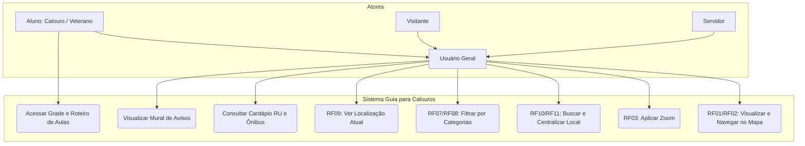
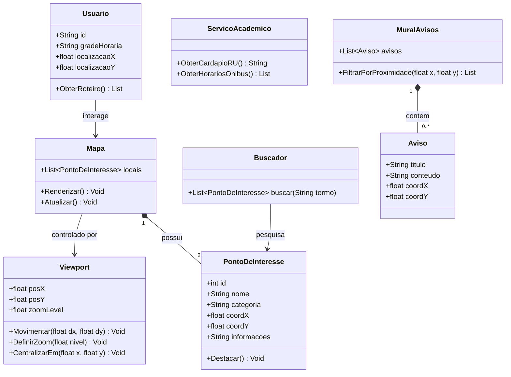
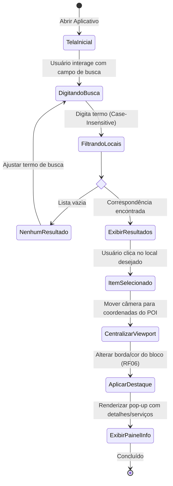
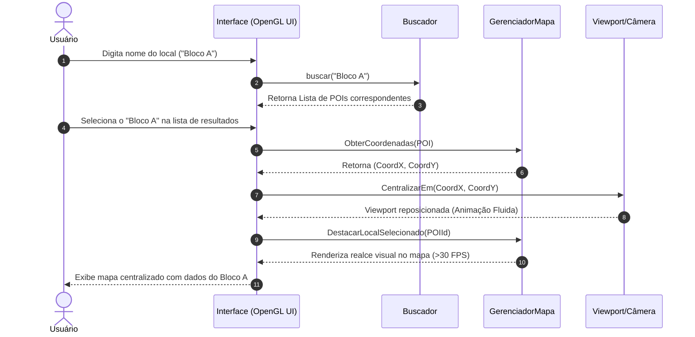
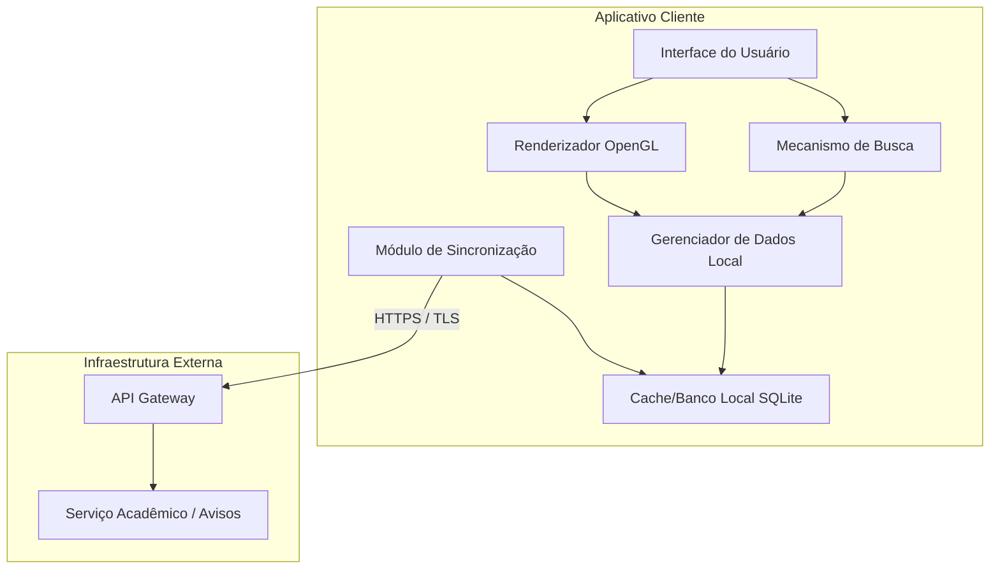
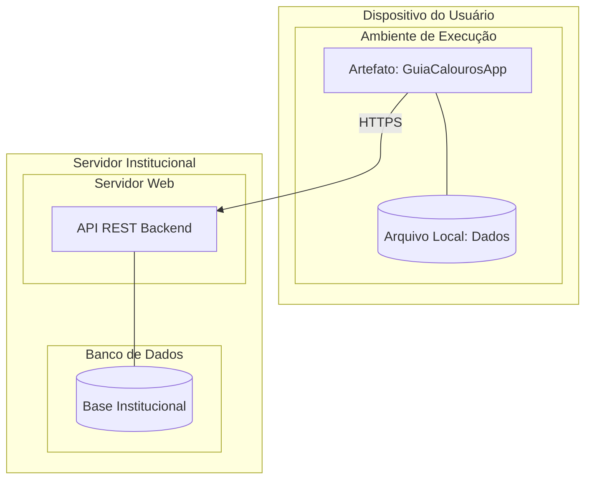

#  Documento de Requisitos e Projeto de Software

---

## 1. Introdução

### 1.1 Objetivo

Este documento tem como objetivo especificar os requisitos do **Guia para Calouros: Mapeamento do Campus**.

O sistema proposto consiste em uma aplicação gráfica desenvolvida com OpenGL que tem como finalidade:
- Realizar o mapeamento visual do campus, facilitando a locomoção e orientação de estudantes (especialmente calouros), visitantes e servidores
- Servir como ferramenta central de integração para a comunidade acadêmica, centralizando informações sobre Restaurante Universitário (RU), horários de ônibus, processos administrativos e mural de avisos
- Reduzir a perda de tempo com deslocamentos e a fragmentação de informações atualmente existente na universidade

Este documento serve como base para desenvolvimento, testes e validação do sistema, além de alinhar a equipe de desenvolvimento e os stakeholders.

---

### 1.2 Escopo

**O sistema faz:**
- Exibição de um mapa gráfico interativo do campus da UFR utilizando OpenGL
- Navegação pelo mapa (movimentação de câmera/viewport)
- Zoom para aproximar e afastar a visualização
- Identificação de blocos, salas e locais importantes com nomes
- Seleção de pontos do mapa para exibir informações detalhadas
- Destaque visual do local selecionado
- Exibição e filtragem de locais por categorias (salas, laboratórios, cantina, secretaria)
- Exibição da localização atual do usuário (real ou simulada)
- Busca de locais pelo nome com centralização automática
- Reinício da visualização para posição inicial
- Interação via mouse, teclado e touch screen (mobile)
- Acesso a informações complementares (cardápio do RU, horários de ônibus)
- Exibição de roteiro entre salas com base na grade horária do aluno
- Mural de avisos geolocalizados

**Limites do sistema:**
- O mapa é estático baseado em levantamento inicial da estrutura do campus
- A localização do usuário pode ser simulada quando GPS não estiver disponível
- O sistema não realiza navegação por turn-by-turn

**Fora do escopo (versão inicial):**
- Integração completa com sistemas acadêmicos da UFR em tempo real (depende de autorização institucional)
- Cálculo automático de rotas otimizadas
- Notificações push avançadas
- Versão web (o sistema é desktop/mobile nativo com OpenGL)
- Chat ou fórum entre usuários

---

### 1.3 Definições, Acrônimos e Abreviações

| Termo/Acrônimo | Definição |
|----------------|-----------|
| **UFR** | Universidade Federal de Rondonópolis |
| **OpenGL** | Open Graphics Library – biblioteca gráfica utilizada para renderização 2D/3D |
| **RU** | Restaurante Universitário |
| **FPS** | Quadros por segundo (Frames Per Second) – métrica de fluidez visual |
| **GPS** | Sistema de Posicionamento Global – utilizado para obter localização do usuário |
| **LGPD** | Lei Geral de Proteção de Dados (Lei nº 13.709/2018) |
| **Viewport** | Área da tela onde o mapa é exibido |
| **Câmera** | Referência à posição e ângulo de visualização do mapa |
| **RF** | Requisito Funcional |
| **RNF** | Requisito Não Funcional |
| **POI** | Ponto de Interesse (Point of Interest) – locais como blocos, salas, laboratórios |
| **HyperOS** | Sistema operacional da Xiaomi utilizado em dispositivos móveis |

---

## 2. Product Vision

### 2.1 Problema

Muitos estudantes, especialmente os calouros, enfrentam dificuldades significativas ao ingressar na UFR devido a:

- **Complexidade Estrutural:** Campus amplo com múltiplos blocos, laboratórios e secretarias sem uma sinalização digital adequada.
- **Perda de Tempo:** Atrasos em aulas e reuniões por dificuldade em localizar salas específicas.
- **Fragmentação de Informações:** Informações sobre o Restaurante Universitário (RU), horários de ônibus e processos administrativos estão dispersas em diferentes canais.

### 2.2 Solução

Desenvolvimento de uma aplicação gráfica com OpenGL que oferece:
- Mapa interativo do campus com navegação visual
- Centralização de informações acadêmicas e administrativas
- Busca e localização de salas, blocos e serviços
- Roteiro baseado na grade horária do aluno
- Avisos geolocalizados e informações em tempo real (RU, ônibus)

### 2.3 Público-Alvo

- **Calouros:** Principal público, com maior dificuldade de ambientação
- **Veteranos:** Para otimizar deslocamentos entre aulas
- **Visitantes:** Participantes de eventos e palestras
- **Servidores:** Para orientação e referência dentro do campus

### 2.4 Proposta de Valor

Ser a ferramenta central de navegação e integração para a comunidade acadêmica da UFR, eliminando a perda de tempo com localização de salas e a fragmentação de informações sobre RU, ônibus e processos administrativos.

### 2.5 Diferencial

- Integração de múltiplos serviços em um único aplicativo (mapa + RU + ônibus + grade horária)
- Funcionamento offline para navegação básica no mapa
- Desenvolvido especificamente para a realidade do campus da UFR
- Geolocalização de avisos relevantes para o trajeto do usuário

### 2.6 Funcionalidades principais (alto nível)

- Mapa interativo com navegação, zoom e busca
- Central de serviços (cardápio RU, horários de ônibus)
- Roteiro entre salas baseado na grade horária
- Mural de avisos geolocalizados
- Filtros por categorias de locais

---

## 3. Visão Geral do Sistema

### 3.1 Descrição Geral

O sistema proposto consiste em uma aplicação gráfica desenvolvida com OpenGL que tem como objetivo realizar o mapeamento visual da universidade, facilitando a locomoção e orientação de estudantes, especialmente calouros, dentro do campus.

Atualmente, muitos alunos enfrentam dificuldades para localizar salas, blocos, setores administrativos e outros pontos importantes da universidade, principalmente no início do período letivo. A ausência de um sistema visual interativo pode causar atrasos, desorientação e perda de tempo.

A solução proposta é a criação de um mapa interativo em ambiente gráfico 2D ou 3D, no qual o usuário poderá visualizar a estrutura da universidade, identificar locais importantes e obter informações básicas sobre cada ponto do campus. O sistema permitirá navegação visual e interação com os elementos exibidos, além de integrar serviços complementares como cardápio do RU, horários de ônibus e mural de avisos.

### 3.2 Stakeholders

| Tipo | Descrição |
|------|------------|
| **Usuários** | Alunos (calouros e veteranos), visitantes, servidores |
| **Clientes** | Universidade Federal de Rondonópolis (UFR) |
| **Desenvolvedores** | Equipe do projeto (Group-09) |

---

## 4. Requisitos Funcionais

### RF01 - Exibir mapa gráfico da universidade

**Descrição:** O sistema deve renderizar e exibir um mapa gráfico interativo da UFR utilizando a biblioteca OpenGL.

**Prioridade:** Alta
**Entradas:** Dados geométricos do mapa (blocos, salas, laboratórios, caminhos)
**Saídas:** Mapa 2D ou 3D renderizado na tela
**Regras de negócio:** O mapa deve representar com fidelidade a disposição real do campus. A renderização deve manter no mínimo 30 FPS.

---

### RF02 - Navegação pelo mapa

**Descrição:** O sistema deve permitir que o usuário navegue pelo mapa, movimentando a câmera ou a viewport.

**Prioridade:** Alta
**Entradas:** Movimento do mouse (arrastar), teclas de seta, toque e arrasto (touch screen)
**Saídas:** Deslocamento da visualização do mapa para diferentes regiões do campus
**Regras de negócio:** A movimentação deve ser fluida e suave, sem travamentos.

---

### RF03 - Aplicar zoom

**Descrição:** O sistema deve permitir que o usuário aplique zoom para aproximar ou afastar a visualização do mapa.

**Prioridade:** Alta
**Entradas:** Rolagem do mouse, gestos de pinça (touch screen), botões de zoom na interface
**Saídas:** Aumento ou redução da escala do mapa exibido
**Regras de negócio:** O zoom deve ter limites mínimo e máximo. O centro do zoom deve ser a posição atual do cursor/ponto de toque.

---

### RF04 - Exibir identificações dos locais

**Descrição:** O sistema deve exibir os nomes dos blocos, salas e locais importantes diretamente no mapa.

**Prioridade:** Alta
**Entradas:** Base de dados com nomes e coordenadas de cada local
**Saídas:** Textos sobrepostos ao mapa indicando o nome de cada local
**Regras de negócio:** As identificações devem ser legíveis mesmo com zoom afastado. Em zoom muito distante, nomes podem ser ocultados.

---

### RF05 - Selecionar pontos do mapa

**Descrição:** O sistema deve permitir que o usuário selecione qualquer ponto do mapa para visualizar informações detalhadas.

**Prioridade:** Alta
**Entradas:** Clique do mouse ou toque na tela
**Saídas:** Exibição de informações detalhadas do local selecionado (nome, tipo, horários, serviços)
**Regras de negócio:** A seleção deve ser indicada visualmente. Informações devem aparecer em painel ou pop-up.

---

### RF06 - Destacar local selecionado

**Descrição:** O sistema deve destacar visualmente o local que foi selecionado pelo usuário.

**Prioridade:** Média
**Entradas:** Evento de seleção (clique/toque)
**Saídas:** Alteração visual do elemento selecionado (borda colorida, mudança de cor, brilho)
**Regras de negócio:** O destaque deve ser claramente perceptível. Apenas um local pode estar destacado por vez.

---

### RF07 - Exibir categorias de locais

**Descrição:** O sistema deve permitir a visualização de locais organizados por categorias (salas, laboratórios, cantina, secretaria).

**Prioridade:** Média
**Entradas:** Dados de categoria associados a cada local
**Saídas:** Locais exibidos com cores ou ícones diferentes por categoria
**Regras de negócio:** As categorias devem ser predefinidas. O usuário deve conseguir identificar facilmente a categoria de cada local.

---

### RF08 - Ativar/desativar categorias

**Descrição:** O sistema deve permitir que o usuário ative ou desative a visualização de categorias específicas de locais.

**Prioridade:** Média
**Entradas:** Checkboxes, botões toggle ou menu de seleção de categorias
**Saídas:** Exibição apenas dos locais das categorias selecionadas
**Regras de negócio:** Por padrão, todas as categorias devem estar ativas.

---

### RF09 - Exibir localização atual do usuário

**Descrição:** O sistema deve exibir a localização atual do usuário no mapa (real ou simulada).

**Prioridade:** Média
**Entradas:** Dados de GPS do dispositivo ou seleção manual de ponto de partida
**Saídas:** Marcador indicando a posição atual do usuário no mapa
**Regras de negócio:** O sistema deve solicitar permissão de localização quando necessário.

---

### RF10 - Buscar locais pelo nome

**Descrição:** O sistema deve permitir que o usuário busque por locais específicos digitando o nome.

**Prioridade:** Alta
**Entradas:** Texto digitado em campo de busca
**Saídas:** Lista de resultados correspondentes à busca
**Regras de negócio:** A busca deve ser case-insensitive e permitir busca parcial.

---

### RF11 - Centralizar no local buscado

**Descrição:** Após uma busca, o sistema deve centralizar o mapa automaticamente no local selecionado.

**Prioridade:** Alta
**Entradas:** Seleção de um item na lista de resultados da busca
**Saídas:** Movimentação da câmera para centralizar o local escolhido
**Regras de negócio:** O local deve ser automaticamente destacado. O zoom deve ajustar-se para boa visibilidade.

---

### RF12 - Reiniciar visualização para posição inicial

**Descrição:** O sistema deve permitir que o usuário reinicie a visualização para a posição e zoom iniciais.

**Prioridade:** Baixa
**Entradas:** Botão "Reset" ou tecla de atalho
**Saídas:** Mapa retornando à posição padrão (visão geral do campus)
**Regras de negócio:** A posição inicial deve ser a mesma do primeiro carregamento.

---

### RF13 - Interação via mouse, teclado e touch

**Descrição:** O sistema deve permitir interação completa por diferentes dispositivos de entrada.

**Prioridade:** Alta
**Entradas:** Mouse, teclado, touch screen
**Saídas:** Navegação, seleção, zoom e busca por qualquer modalidade
**Regras de negócio:** O sistema deve detectar automaticamente o tipo de dispositivo quando possível.

---

## 5. Requisitos Não Funcionais

### 5.1 Usabilidade

**Interface intuitiva**
A interface deve ser intuitiva e de fácil aprendizado para novos usuários. O sistema deve permitir navegação simples utilizando mouse e teclado.

**Tempo de aprendizado < X minutos**
Tempo de aprendizado < 5 minutos para que um novo usuário consiga realizar as tarefas principais (navegar, buscar, selecionar locais).

**Acessibilidade**
O sistema deve apresentar elementos visuais claros e legíveis. Botões e textos devem ser de fácil visualização sob luz solar. Suporte básico a navegação por teclado.

---

### 5.2 Eficiência

**Tempo de resposta < X segundos**
O sistema deve responder às interações do usuário em até 1 segundo.

**Suporte a múltiplos usuários**
O sistema é uma aplicação cliente local/offline, sem arquitetura cliente-servidor para uso simultâneo.

---

### 5.3 Desempenho

**Suporte a X usuários simultâneos**
Por ser uma aplicação offline, não importa a quantidade de usuários ao mesmo tempo.

**Estabilidade sob carga**
O sistema deve evitar falhas durante a execução, mesmo com uso contínuo. O sistema deve tratar erros de entrada sem interromper a execução. O sistema deve renderizar o mapa com no mínimo 30 FPS.

---

### 5.4 Espaço

**Limite de armazenamento**
O aplicativo deve ser leve para garantir fluidez em dispositivos com hardware limitado. Dados do mapa devem ocupar espaço reduzido em disco.

**Uso eficiente de memória**
O sistema deve funcionar em computadores com suporte básico a OpenGL, exigindo baixo consumo de memória RAM.

---

### 5.5 Confiabilidade

**Disponibilidade mínima (ex: 99,9%)**
Por ser uma aplicação local/offline, a disponibilidade é de 100% após instalada, independente de conexão com internet.

**Recuperação de falhas**
O sistema deve evitar falhas durante a execução. Em caso de erro, deve tratar sem interromper a execução. O sistema deve ser estruturado de forma modular para facilitar manutenção.

---

### 5.6 Segurança (Proteção)

**Autenticação**
O sistema deve proteger os dados de login e a grade horária dos alunos. A sincronização de dados acadêmicos deve ser feita via autenticação segura.

**Criptografia**
Dados sensíveis (credenciais, grade horária) devem ser armazenados localmente com criptografia básica.

**Controle de acesso**
Informações sensíveis do mural de avisos devem ser moderadas para evitar conteúdo impróprio ou ataques de script. Apenas usuários autenticados podem acessar dados acadêmicos pessoais.

---

## 6. Requisitos Organizacionais

### 6.1 Ambientais

**Sistema operacional**
O sistema deve ser compatível com Windows, Linux, Android, iOS e HyperOS. Deve funcionar em computadores com suporte básico a OpenGL.

**Infraestrutura**
O sistema não depende de servidor central para funcionamento básico. O mapa deve funcionar offline. Apenas funcionalidades complementares (RU, ônibus, avisos) podem depender de internet para atualizações.

---

### 6.2 Operacionais

**Logs**
O sistema deve registrar eventos relevantes (erros de renderização, falhas, buscas) em arquivos de log locais para depuração.

**Monitoramento**
Em caso de falhas recorrentes, o sistema pode solicitar envio de relatórios de erro anonimizados.

---

### 6.3 Desenvolvimento

**Versionamento (Git)**
O código-fonte deve ser mantido em repositório Git, com commits regulares e mensagens descritivas.

**Padrões de código**
O código deve seguir boas práticas e ser documentado. Deve ser estruturado de forma modular.

**Testes automatizados**
O sistema deve incluir testes básicos para funcionalidades críticas (renderização, busca, seleção). Testes de unidade e integração.

---

## 7. Requisitos Externos

### 7.1 Reguladores

**LGPD**
O sistema deve estar em conformidade com a LGPD (Lei nº 13.709/2018). Dados pessoais devem ser coletados apenas com consentimento explícito.

**Normas específicas**
O sistema deve respeitar as políticas internas de TI da UFR quanto ao uso de dados acadêmicos.

---

### 7.2 Éticos

**Não discriminação**
O sistema deve tratar todos os usuários de forma igualitária, sem qualquer tipo de discriminação.

**Transparência**
O sistema deve informar claramente quais dados estão sendo coletados e para qual finalidade. Funcionalidades de localização exigem permissão explícita.

---

### 7.3 Legais

**Leis aplicáveis**
Além da LGPD: Marco Civil da Internet (Lei nº 12.965/2014), Código de Defesa do Consumidor (Lei nº 8.078/1990), direitos autorais para uso de bibliotecas de terceiros.

---

### 7.4 Segurança Externa

**Proteção contra ataques**
Dados sensíveis devem ser protegidos com criptografia. Comunicação externa deve usar HTTPS/TLS. Entradas do usuário devem ser sanitizadas.

**Auditorias**
Recomenda-se revisão de código por pares antes de cada release. Logs anonimizados podem ser gerados para auditoria interna.

---

### 7.5 Contábeis

**Registro de transações**
Não aplicável. O sistema não realiza transações financeiras.

**Relatórios**
Não aplicável para versão inicial.

---

##  8. Arquitetura do Sistema

### 8.1 Visão Geral
O sistema adota uma arquitetura **monolítica modular** com estilo **MVC (Model-View-Controller)**, voltada para aplicação gráfica desktop/mobile offline-first. A separação em módulos facilita a manutenção e testes, enquanto a ausência de servidor central reduz latência e dependências externas.

### 8.2 Componentes
- **Frontend (View + Controller local):**  
  Renderização OpenGL, interface de usuário (botões, menus, painéis) e gerenciamento de entradas (mouse, teclado, toque).

- **Backend (Model + lógica de negócio):**  
  Camada local que gerencia dados do mapa, POIs, categorias, grade horária, cache de serviços e persistência.

- **Banco de dados:**  
  Não há SGBD central. Utiliza-se **arquivos JSON** e **SQLite** embarcado para persistência local.

- **APIs externas:**  
  Conexão opcional para atualização de cardápio do RU, horários de ônibus e avisos via requisições HTTP (HTTPS).

### 8.3 Tecnologias
| Componente | Tecnologia |
|------------|------------|
| **Linguagem principal** | C++17 (ou Python 3.10+ com PyOpenGL) |
| **Renderização gráfica** | OpenGL 3.3+ |
| **Janela e entrada** | GLFW / SDL2 |
| **Interface gráfica (UI)** | Dear ImGui (prototipação) ou GUI nativa |
| **Persistência local** | SQLite3 + nlohmann/json (C++) |
| **Requisições HTTP** | libcurl (C++) / requests (Python) |
| **Criptografia** | OpenSSL / Crypto++ (AES-256) |
| **Testes** | Google Test (C++) / pytest (Python) |
| **Build e dependências** | CMake, vcpkg / pip |
 

### 8.4 Decisões Arquiteturais
A arquitetura foi definida para atender aos requisitos não funcionais:

- **Desempenho:**  
  - Renderização direta com OpenGL evita overhead de navegadores.  
  - Cache local (JSON/SQLite) reduz latência de acesso a dados de serviços.  
  - Níveis de detalhe (LOD) para POIs em zoom distante.

- **Segurança:**  
  - Dados sensíveis (login, grade horária) armazenados com criptografia AES local.  
  - Comunicação externa sempre via HTTPS/TLS.  
  - Sanitização de entradas (busca, login) para evitar injeção.

- **Escalabilidade (horizontal):**  
  - Não é necessária, pois o sistema é offline. No entanto, a estrutura modular permite adicionar novas fontes de dados ou migrar para arquitetura cliente-servidor no futuro.

- **Manutenibilidade:**  
  - Padrão MVC separa responsabilidades.  
  - Componentes internos bem definidos (renderizador, navegação, busca, persistência).  
  - Uso de injeção de dependência simplificada.

---

##  9. Casos de Uso e Diagramas

### 9.1 Casos de Uso
### UC01 - Visualizar mapa e navegar
**Ator:** Aluno (calouro/veterano), visitante, servidor  
**Descrição:** O usuário abre o aplicativo e visualiza o mapa do campus, podendo movimentar a câmera e aplicar zoom.  
**Fluxo principal:**  
1. Usuário inicia o sistema.  
2. O mapa é carregado na posição padrão (visão geral).  
3. Usuário arrasta o mouse/toque para mover o viewport.  
4. Usuário usa scroll/pinça para zoom.  
5. O sistema atualiza a visualização em tempo real.  
**Fluxo alternativo:**  
- Caso o arquivo de mapa esteja corrompido, o sistema exibe mensagem de erro e permite reinstalação.

---

### UC02 - Aplicar Zoom
**Ator:** Usuário geral  
**Descrição:** O usuário aplica zoom in (aproximação) ou zoom out (afastamento) no mapa para visualizar detalhes ou obter uma visão macro do campus.  
**Fluxo principal:**  
1. Usuário posiciona o cursor/ponto de toque sobre a área do mapa.  
2. Usuário aciona o scroll do mouse ou realiza o gesto de pinça (em dispositivos móveis).  
3. O sistema detecta a direção do gesto (zoom in/out) e calcula o novo nível de zoom.  
4. O sistema valida se o novo nível está dentro dos limites mínimo e máximo permitidos.  
5. O sistema atualiza a propriedade `zoomLevel` da `Viewport` e re-renderiza o mapa em tempo real (>30 FPS).  
**Fluxo alternativo:**  
- Caso o usuário atinja o nível mínimo ou máximo de zoom, o sistema interrompe a movimentação e exibe um feedback visual (ex.: borda do mapa com leve sombra ou indicador de limite).

---

### UC03 - Buscar e Centralizar Local
**Ator:** Usuário geral  
**Descrição:** O usuário digita o nome de um ponto de interesse (POI) no campo de busca, seleciona o resultado desejado e o sistema centraliza o mapa no local, destacando-o e exibindo suas informações.  
**Fluxo principal:**  
1. Usuário clica no campo de busca da interface.  
2. Usuário digita o nome (ou parte do nome) do local desejado (ex.: "Bloco A").  
3. O sistema aciona o `Buscador` para filtrar a lista de `PontoDeInteresse` de forma *case-insensitive*.  
4. O sistema exibe a lista de resultados correspondentes na interface.  
5. Usuário seleciona o local desejado na lista de resultados.  
6. O sistema obtém as coordenadas (`coordX`, `coordY`) do POI selecionado.  
7. O sistema chama o método `CentralizarEm()` da `Viewport` para reposicionar a câmera com animação fluida.  
8. O sistema aplica destaque visual ao POI no mapa (alteração de borda/cor).  
9. O sistema exibe um painel informativo (pop-up) com detalhes e serviços do local.  
**Fluxo alternativo:**  
- Caso a busca não retorne nenhum resultado, o sistema exibe a mensagem "Nenhum local encontrado" e permanece aguardando o ajuste do termo de busca pelo usuário.

---

### UC04 - Filtrar por Categorias
**Ator:** Usuário geral  
**Descrição:** O usuário filtra os pontos de interesse exibidos no mapa de acordo com categorias específicas (ex.: Alimentação, Ensino, Administrativo, Estacionamento, Banheiros).  
**Fluxo principal:**  
1. Usuário acessa o menu ou botão de filtros na interface.  
2. O sistema exibe a lista de categorias disponíveis (extraídas dos atributos dos `PontoDeInteresse`).  
3. Usuário seleciona uma ou mais categorias desejadas.  
4. O sistema percorre a lista de POIs e oculta aqueles cuja categoria não corresponde às selecionadas.  
5. O sistema atualiza a renderização do mapa, exibindo apenas os POIs filtrados.  
6. (Opcional) O sistema ajusta a viewport para enquadrar todos os POIs exibidos.  
**Fluxo alternativo:**  
- Caso o usuário desmarque todas as categorias, o sistema restaura automaticamente a exibição padrão com todos os POIs visíveis.

---

### UC05 - Ver Localização Atual
**Ator:** Usuário geral  
**Descrição:** O usuário visualiza sua posição física atual no mapa do campus através do recurso de geolocalização do dispositivo.  
**Fluxo principal:**  
1. Usuário clica no botão "Minha Localização" (ícone de alvo/mira).  
2. O sistema solicita permissão de acesso à geolocalização do dispositivo (caso ainda não tenha sido concedida).  
3. O sistema obtém as coordenadas atuais (`localizacaoX`, `localizacaoY`) do dispositivo.  
4. O sistema atualiza o objeto `Usuario` com as novas coordenadas.  
5. O sistema centraliza a `Viewport` nas coordenadas do usuário.  
6. O sistema insere um marcador diferenciado (ex.: ponto azul pulsante) no mapa para indicar a posição exata.  
**Fluxo alternativo:**  
- Caso o sistema não consiga obter a localização (GPS desativado, permissão negada ou sinal fraco), exibe uma mensagem de erro com orientações para ativar o serviço de localização.

---

### UC06 - Acessar Grade e Roteiro de Aulas
**Ator:** Aluno (calouro/veterano)  
**Descrição:** O aluno consulta sua grade horária de aulas e, ao selecionar uma disciplina, obtém um roteiro de deslocamento (caminho) no mapa até a sala onde ocorrerá a aula.  
**Fluxo principal:**  
1. Aluno acessa a funcionalidade "Minha Grade" no menu principal.  
2. O sistema carrega a `gradeHoraria` associada ao `Usuario` logado.  
3. O sistema exibe a grade horária em formato de tabela/listagem.  
4. Aluno seleciona uma disciplina/aula específica da grade.  
5. O sistema identifica o `PontoDeInteresse` (sala/bloco) correspondente à disciplina.  
6. O sistema obtém a localização atual do aluno (via UC05).  
7. O sistema chama o método `ObterRoteiro()` para calcular o trajeto entre a localização atual e a sala de destino.  
8. O sistema desenha a rota calculada sobre o mapa e exibe orientações textuais (ex.: "Vire à esquerda no Bloco B").  
**Fluxo alternativo:**  
- Caso o aluno não possua grade horária cadastrada no sistema, o sistema exibe a mensagem "Nenhuma grade encontrada. Entre em contato com a coordenação acadêmica."

---

### UC07 - Consultar Cardápio RU e Ônibus
**Ator:** Usuário geral  
**Descrição:** O usuário consulta informações atualizadas sobre o cardápio do Restaurante Universitário (RU) e os horários de saída dos ônibus internos/universitários, obtidos via integração com a API institucional.  
**Fluxo principal:**  
1. Usuário acessa o módulo "Serviços" no aplicativo.  
2. Usuário seleciona a opção desejada: "Cardápio RU" ou "Horários de Ônibus".  
3. O sistema aciona o `Módulo de Sincronização` para realizar uma requisição HTTPS ao `API Gateway` da UFR Cloud.  
4. O sistema recebe os dados (cardápio do dia ou lista de horários) e armazena em cache local.  
5. O sistema exibe as informações em formato legível (texto/tabela) para o usuário.  
**Fluxo alternativo:**  
- Caso a conexão com o servidor falhe ou o tempo expire, o sistema consulta o cache local (`Banco SQLite`) e exibe os dados da última sincronização bem-sucedida, acompanhados de um aviso de "Dados desatualizados" para o usuário.

---

### UC08 - Visualizar Mural de Avisos
**Ator:** Usuário geral  
**Descrição:** O usuário visualiza o mural de avisos institucionais publicados, podendo ativar um filtro que exibe apenas os avisos geograficamente próximos à sua localização atual.  
**Fluxo principal:**  
1. Usuário acessa a tela "Mural de Avisos" no menu.  
2. O sistema carrega a lista de `Aviso` do banco local (cache).  
3. O sistema exibe os avisos ordenados por data de publicação (mais recentes primeiro).  
4. Usuário ativa o filtro "Avisos Próximos" (toggle/checkbox).  
5. O sistema obtém a localização atual do usuário.  
6. O sistema percorre a lista de avisos e utiliza o método `FiltrarPorProximidade()` (comparando as coordenadas do aviso com a do usuário).  
7. O sistema atualiza a lista exibida, mostrando apenas os avisos relevantes geograficamente.  
**Fluxo alternativo:**  
- Caso não existam avisos cadastrados no sistema, o aplicativo exibe a mensagem "Nenhum aviso disponível no momento."  
- Caso o filtro de proximidade seja desativado, o sistema restaura a exibição da lista completa de avisos.
---
## 9.2 Diagrama de Casos de Uso

## 9.3 Diagrama de Classes (UML)

## 9.4 Diagrama de Atividades (UML)

## 9.5 Diagrama de Sequência (UML)

## 9.6 Diagrama de Componentes

## 9.7 Diagrama de Implantação (Deployment)

---
##  10. Plano de Testes

### 10.1 Estratégia de Teste
Adota-se uma abordagem **híbrida**: testes automatizados (unidade e integração) e testes manuais (sistema, usabilidade, aceitação). A automação foca em componentes críticos (lógica de busca, picking, criptografia, persistência), enquanto os testes de interface e desempenho são conduzidos manualmente em diferentes dispositivos.

### 10.2 Tipos de Teste
| Tipo | Descrição | Ferramenta / Método |
|------|-----------|---------------------|
| **Unitário** | Validação de funções e classes individuais | Google Test / pytest |
| **Integração** | Comunicação entre módulos (Controller ↔ Model, View ↔ Controller) | Scripts manuais + Google Test |
| **Sistema** | Execução de todos os requisitos funcionais no ambiente alvo | Manual (checklist) |
| **Aceitação** | Usuários reais (calouros) realizam tarefas | Teste de usabilidade + questionário SUS |
### 10.3 Casos de Teste

#### CT01 - Renderização inicial do mapa
**Requisito relacionado:** RF01  
**Descrição:** Verificar se o mapa é exibido corretamente ao iniciar o aplicativo.  
**Entrada:** Inicialização padrão.  
**Resultado esperado:** Mapa visível, blocos identificáveis, FPS ≥ 30.

#### CT02 - Navegação por arrasto
**Requisito relacionado:** RF02  
**Descrição:** Arrastar o mapa com mouse/toque.  
**Entrada:** Movimento contínuo do ponteiro/toque.  
**Resultado esperado:** Mapa desloca-se suavemente, sem solavancos ou atrasos > 1s.

#### CT03 - Busca por nome parcial
**Requisito relacionado:** RF10, RF11  
**Descrição:** Digitar “Lab” na busca.  
**Entrada:** Texto “Lab”.  
**Resultado esperado:** Lista contendo “Laboratório de Informática”, “Laboratório de Química” etc. Ao selecionar, mapa centraliza e aplica zoom.

#### CT04 - Persistência de login e grade
**Requisito relacionado:** RNF09, RNF11 (segurança)  
**Descrição:** Após login e inserção da grade, fechar e reabrir o app.  
**Entrada:** Credenciais válidas, grade preenchida.  
**Resultado esperado:** Dados recuperados e ainda criptografados (não legível em arquivo texto puro).

#### CT05 - Comportamento offline da Central de Serviços
**Requisito relacionado:** (Serviços complementares)  
**Descrição:** Acessar cardápio do RU sem conexão de internet.  
**Entrada:** Modo avião ativado.  
**Resultado esperado:** Exibe último cardápio em cache com mensagem “dados offline”.

---

### 10.4 Testes de Requisitos Não Funcionais
- **Performance:**  
  - Medir tempo de resposta das interações (busca, zoom, clique) – deve ser ≤ 1s.  
  - Verificar FPS durante navegação intensa (mover rapidamente o mapa) – mínimo 30 FPS.

- **Segurança:**  
  - Tentar acessar arquivos de dados diretamente – credenciais e grade devem estar criptografadas.  
  - Inserir entradas maliciosas na busca (SQL injection, script) – sistema deve sanitizar e não travar.

- **Usabilidade:**  
  - Recrutar 10 calouros, cronometrar tempo para realizar tarefas (navegar, buscar, reset).  
  - Aplicar SUS (System Usability Scale) – meta: pontuação ≥ 70.

--- 

---

##  11. Critérios de Aceitação

Para que o sistema seja aceito, os seguintes critérios devem ser cumpridos:

| ID | Critério | Métrica / Validação | Condição de Sucesso |
|----|----------|---------------------|----------------------|
| CA01 | Todos os RFs implementados | Execução dos casos de teste CT01 a CT05 + demais RFs | 100% de RFs executados com sucesso |
| CA02 | Desempenho mínimo | Medição de FPS e tempo de resposta | FPS médio ≥ 30 e tempo resposta ≤ 1s |
| CA03 | Usabilidade | Teste com 10 usuários (calouros) | Todas as tarefas realizadas em < 5 min; SUS ≥ 70 |
| CA04 | Confiabilidade | Execução contínua por 2h simulando uso | Zero crashes ou corrupção de dados |
| CA05 | Segurança | Inspeção de código + testes de injeção | Dados sensíveis criptografados; entradas sanitizadas |
| CA06 | Compatibilidade | Execução em pelo menos 1 dispositivo de cada família: Windows, Linux, Android, iOS/HyperOS | Sistema abre e funciona sem erros críticos |
| CA07 | Documentação e versionamento | Repositório Git com histórico claro, código comentado, instruções de build | Aprovado pelo professor/orientador |
| CA08 | Entrega no prazo | Todos os artefatos entregues até a data estipulada | Cumprimento do cronograma do laboratório |
---

## 12. Restrições

- **Tecnológicas:**
  - O sistema deve ser desenvolvido utilizando OpenGL 3.3+ para renderização gráfica.
  - O sistema não pode depender de serviços pagos de terceiros (APIs de mapas, geolocalização, etc.).
  - O mapa deve ser armazenado em arquivos estáticos locais (JSON/XML) e funcionar offline.
  - A comunicação com APIs externas (RU, ônibus) deve ser feita exclusivamente via HTTPS/TLS.
  - O sistema deve ser compatível com dispositivos com suporte mínimo a OpenGL (GPUs integradas básicas).
  - O código-fonte deve ser escrito em C++17 (ou Python 3.10+) e gerenciado com CMake.

- **Legais:**
  - O sistema deve estar em conformidade com a LGPD (Lei nº 13.709/2018) para proteção de dados pessoais.
  - Deve respeitar o Marco Civil da Internet (Lei nº 12.965/2014).
  - Uso de bibliotecas de terceiros deve respeitar suas licenças de uso (MIT, Apache, GPL etc.).
  - O sistema deve seguir as políticas internas de TI da UFR quanto ao uso de dados acadêmicos.
  - O sistema não pode armazenar dados biométricos ou informações sensíveis além do necessário.

- **De prazo:**
  - O projeto deve ser entregue dentro do semestre letivo vigente (conforme calendário acadêmico).
  - O protótipo funcional deve estar pronto para apresentação até a data estipulada pelo professor.
  - Cada etapa do projeto (requisitos, arquitetura, protótipo, testes) deve ser entregue em marcos específicos.
  - O código-fonte deve estar disponível em repositório Git até a data de entrega final.

---

## 13. Premissas

- **Usuário terá acesso à internet** para atualizações de RU, ônibus e avisos (funcionalidades complementares).
- **Sistema será usado em dispositivos móveis** (Android, iOS, HyperOS), sendo a interface otimizada para telas menores e toque.
- Os dispositivos dos usuários possuem suporte básico à OpenGL.
- Os dados acadêmicos (grade horária, localização de salas) serão fornecidos pela instituição ou por fontes públicas confiáveis.
- O mapa do campus não sofre alterações estruturais frequentes, permitindo um levantamento inicial estático.
- Os usuários possuem habilidades básicas de interação com mapas digitais (zoom, arrasto, toque).
- A localização do usuário (GPS) estará disponível na maioria dos dispositivos.
- A UFR fornecerá ou autorizará o uso de dados institucionais para o projeto.
- O sistema será utilizado em ambiente acadêmico com finalidade educacional.
- O ambiente de desenvolvimento (IDE, compilador) estará configurado corretamente.
- As APIs externas para RU e ônibus estarão disponíveis e estáveis no momento do uso.

---

## 14. Observações Finais

- Este documento consolida todos os requisitos e diretrizes para o desenvolvimento do **MapUFR - Sistema de Mapeamento Interativo e Central de Serviços da UFR**.
- O documento é **dinâmico** e pode ser revisado conforme novos requisitos forem identificados ou mudanças forem solicitadas pelos stakeholders.
- Qualquer alteração significativa deve ser comunicada a todos os membros da equipe e ao professor/orientador.
- Em caso de conflito de prazos, priorizar as funcionalidades de maior valor para o usuário (navegação, busca, mapa) em detrimento de funcionalidades complementares.
- Todas as decisões arquiteturais e de escopo devem ser documentadas no repositório do projeto.
- O sistema será desenvolvido com foco em **usabilidade, desempenho e segurança**, atendendo às necessidades da comunidade acadêmica da UFR.
- A equipe está comprometida com a entrega de um produto funcional, bem documentado e alinhado com os requisitos especificados neste documento.

---

#  Orientações importantes

- Requisitos devem ser claros, específicos e mensuráveis  
- Evite termos vagos como “rápido” ou “bom”  
- Requisitos não funcionais são obrigatórios  
- A arquitetura deve responder aos requisitos  
- Todo requisito deve ser testável  

---
