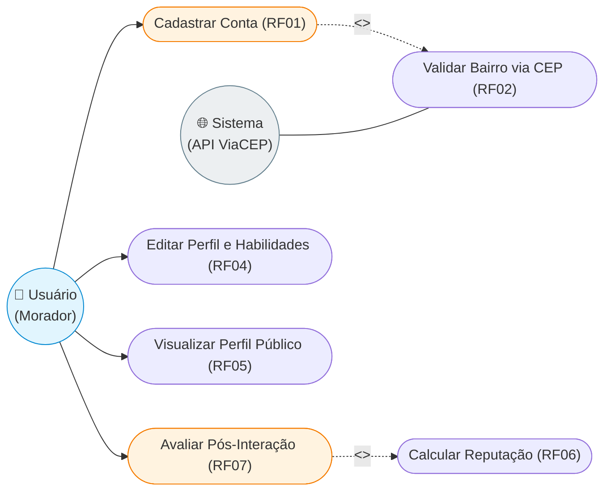
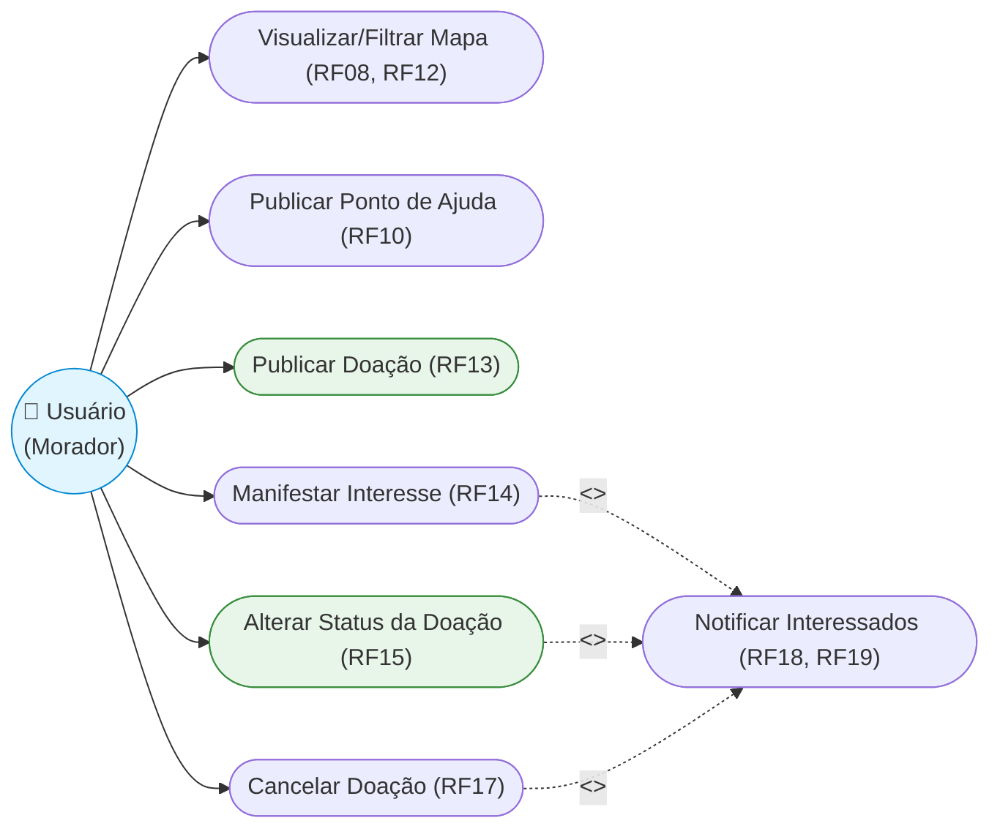
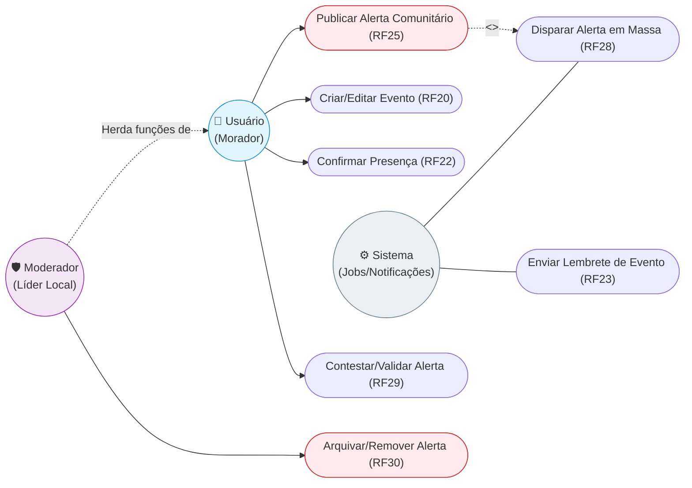
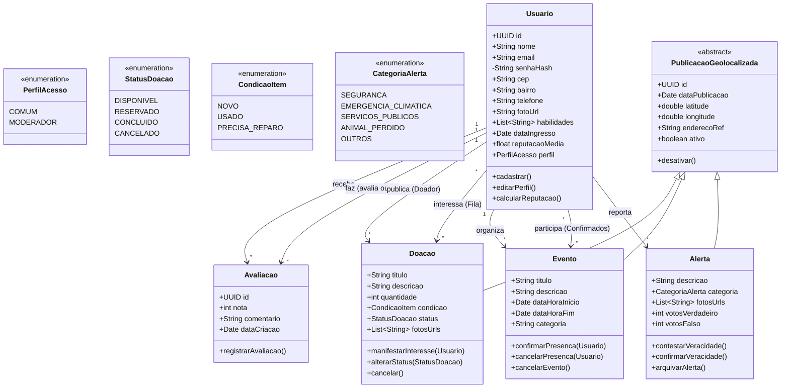

#  Documento de Requisitos e Projeto de Software

---

##  1. Introdução

### 1.1 Objetivo
O objetivo deste documento é especificar detalhadamente os requisitos funcionais, não funcionais, organizacionais, externos e a arquitetura do sistema Conexão Comunitária.
O Conexão Comunitária é uma plataforma digital colaborativa que conecta vizinhos para trocar favores, compartilhar recursos, organizar ações solidárias e disseminar informações relevantes dentro de um mesmo bairro ou região. O objetivo é ser diferente de redes sociais genéricas ou aplicativos de serviços isolados e integrar em um único lugar, alertas de segurança, troca de habilidades, além de outros recursos ja ditos para fortalecer e unir a comunidade local.

### 1.2 Escopo
O Conexão Comunitária é uma plataforma colaborativa que centraliza o compartilhamento de recursos (doações de itens), alertas de segurança pública/infraestrutura, gerenciamento de eventos beneficentes e trocas de habilidades.

- Limites do Sistema: A plataforma atua de forma hiperlocal, segmentando as interações com base no CEP e bairro do usuário para garantir relevância geográfica.

- Fora de Escopo: O sistema não processa transações financeiras (doações em dinheiro), não fornece serviços de frete ou logística de entrega de mercadorias e não realiza moderação de conteúdo automatizada baseada em Inteligência Artificial nesta versão.

### 1.3 Definições, Acrônimos e Abreviações
- RF / FR: Requisito Funcional (Functional Requirement).

- RNF / NFR: Requisito Não Funcional (Non-Functional Requirement).

- LGPD: Lei Geral de Proteção de Dados (Lei nº 13.709/2018).

- MVP: Mínimo Produto Viável (Minimum Viable Product).

- API: Interface de Programação de Aplicação (Application Programming Interface).

- WAF: Firewall de Aplicação Web (Web Application Firewall).

- Rate Limiting: Bloqueio temporário de requisições baseado no volume por IP.

---

##  2. Product Vision

### 2.1 Problema
Atualmente, as redes de apoio de bairros (pedidos de doações, mutirões, alertas de alagamentos ou segurança) operam espalhadas em grupos caóticos de WhatsApp, Facebook ou Telegram. Nesses ambientes, as informações se perdem rapidamente no fluxo de conversas, gerando falta de engajamento, proliferação de notícias falsas e ineficiência na distribuição de ajuda a quem realmente precisa.

### 2.2 Solução
O Conexão Comunitária centraliza e organiza essas interações em uma plataforma estruturada e geolocalizada. Ele transforma mensagens soltas em um painel visual composto por um mapa interativo e listas filtráveis, permitindo que moradores saibam exatamente o que está acontecendo e como podem ajudar em seu próprio bairro.

### 2.3 Público-Alvo
- Moradores locais e vizinhanças voluntárias.

- Associações de moradores e líderes comunitários.

- Centros comunitários, coletivos locais e ONGs regionais.

### 2.4 Proposta de Valor
Para os moradores, o sistema oferece um canal direto, seguro e prático de exercer a solidariedade e se manter informado sobre a segurança local. Para as lideranças comunitárias, atua como uma ferramenta de gestão capaz de mensurar o impacto social, coordenar mutirões e validar a veracidade de incidentes.

### 2.5 Diferencial
Diferente de redes sociais genéricas ou classificados de doação puras, a plataforma une geolocalização estrita via CEP, um índice de reputação por estrelas construído por validações reais e um mecanismo descentralizado de checagem e contestação comunitária de alertas de urgência.

### 2.6 Funcionalidades principais (alto nível)
- Mapa da Solidariedade: Interface interativa para localizar ofertas de ajuda, doações e necessidades ativas.

- Central de Alertas Críticos: Sistema de notificação instantânea de incidentes locais com moderação colaborativa.
  
---

##  3. Visão Geral do Sistema

### 3.1 Descrição Geral
O sistema funciona como uma rede social de utilidade pública baseada no território do usuário. Ao se cadastrar com o CEP, o usuário passa a visualizar o feed de doações, o calendário de eventos locais e o mapa de incidentes restritos à sua região ou bairros vizinhos. Os usuários podem anunciar itens para doação, manifestar interesse em desapegos, confirmar presença em mutirões e reportar ocorrências emergenciais no bairro.

### 3.2 Stakeholders
- Usuários: Cidadãos comuns que utilizam a plataforma para doar, solicitar auxílio ou monitorar alertas locais.

- Clientes: Associações de moradores, prefeituras locais ou ONGs mantenedoras que patrocinam e gerenciam as regras da comunidade.

- Outros (Moderadores): Líderes comunitários responsáveis pela curadoria de alertas e auditoria de abusos reportados no sistema.

---

##  4. Requisitos Funcionais

### RF01 - Cadastro por E-mail e Senha
**Descrição:**  
Permitir que o usuário realize o seu cadastro inicial na plataforma informando suas credenciais de acesso de forma segura.

**Prioridade:** Alta  
**Entradas:** E-mail válido e criação de senha (mínimo de 8 caracteres).  
**Saídas:** Conta de usuário criada na base de dados e mensagem de confirmação de cadastro enviado por e-mail.  
**Regras de negócio:** Não deve ser permitida a criação de mais de uma conta utilizando o mesmo endereço de e-mail.

---

### RF02 - Associação Territorial via CEP
**Descrição:**  
Solicitar, obrigatoriamente no momento do cadastro, o CEP e o nome do bairro do usuário para vinculá-lo ao seu território geográfico de atuação.

**Prioridade:** Alta  
**Entradas:** CEP (8 dígitos) e Nome do Bairro.  
**Saídas:** Vínculo geográfico registrado no perfil do usuário no banco de dados.  
**Regras de negócio:** O nome do bairro deve ser preenchido de forma automática e validada com base no CEP fornecido para evitar cadastros com inconsistências regionais.

---

### RF03 - Complementação de Perfil de Usuário
**Descrição:**  
Permitir que o usuário adicione informações adicionais e personalizadas ao seu perfil após o cadastro inicial.

**Prioridade:** Média  
**Entradas:** Foto de perfil, nome completo, número de telefone, lista de habilidades (tags) e interesses.  
**Saídas:** Perfil de usuário enriquecido e atualizado no banco de dados.  
**Regras de negócio:** A lista de habilidades pode conter opções predefinidas pela plataforma ou novas tags inseridas livremente pelo usuário.

---

### RF04 - Edição de Dados Cadastrais
**Descrição:**  
Permitir que o usuário altere suas informações pessoais, de contato e habilidades sempre que julgar necessário.

**Prioridade:** Alta  
**Entradas:** Modificação dos campos de dados pessoais, foto ou exclusão/adição de novas habilidades.  
**Saídas:** Alerta em tela de "Perfil atualizado com sucesso" e persistência dos dados.  
**Regras de negócio:** A alteração do e-mail principal exige uma revalidação de segurança através de token enviado para o endereço antigo e para o novo.

---

### RF05 - Exibição Pública de Perfil
**Descrição:**  
Disponibilizar uma visualização pública do perfil do usuário para que outros membros da comunidade identifiquem com quem estão interagindo.

**Prioridade:** Alta  
**Entradas:** Requisição de clique para visualização do perfil de um usuário por outro membro cadastrado.  
**Saídas:** Renderização em tela do Nome, foto, bairro, data de ingresso na plataforma e reputação média calculada.  
**Regras de negócio:** Dados estritamente privados como e-mail completo, número de telefone e endereço residencial exato (rua e número) nunca devem ser expostos publicamente.

---

### RF06 - Cálculo do Índice de Reputação
**Descrição:**  
Processar a média aritmética das avaliações recebidas pelo usuário e renderizar esse indicador no formato de pontuação visual.

**Prioridade:** Média  
**Entradas:** Notas coletadas no histórico de interações finalizadas do usuário.  
**Saídas:** Índice numérico e representação gráfica (ex: de 0 a 5 estrelas) atualizado no perfil público.  
**Regras de negócio:** Usuários novos que ainda não participaram de nenhuma transação finalizada exibirão o rótulo "Novo membro" em vez de nota zero.

---

### RF07 - Avaliação Pós-Interação
**Descrição:**  
Permitir que os usuários envolvidos atribuam uma nota e um comentário sobre a experiência ao fim de uma doação ou ajuda mútua.

**Prioridade:** Média  
**Entradas:** Nota de 1 a 5 e comentário opcional em formato de texto.  
**Saídas:** Gravação do registro de avaliação atrelado à contraparte da interação.  
**Regras de negócio:** O formulário de avaliação mútua só ficará disponível para preenchimento após o status da doação ser formalmente alterado para "concluído".

---

### RF08 - Mapa Interativo da Solidariedade
**Descrição:**  
Exibir um mapa dinâmico contendo marcadores visuais geolocalizados com as atividades do bairro.

**Prioridade:** Alta  
**Entradas:** Coordenadas de localização geográfica do bairro ou do dispositivo do usuário.  
**Saídas:** Mapa interativo renderizado em tela com ícones indicativos (pins) de doações, necessidades e eventos.  
**Regras de negócio:** O mapa deve ser atualizado dinamicamente sempre que o usuário arrastar a tela ou alterar o zoom de visualização.

---

### RF09 - Configuração de Raio de Visualização no Mapa
**Descrição:**  
Permitir que o usuário restrinja ou expanda o escopo geográfico dos marcadores exibidos no mapa.

**Prioridade:** Média  
**Entradas:** Seleção de filtro de alcance ("Apenas meu bairro" ou "Incluir bairros vizinhos").  
**Saídas:** Filtragem instantânea e atualização dos pins visíveis no mapa.  
**Regras de negócio:** Por padrão, a inicialização do mapa deve ocultar marcadores pertencentes a bairros distantes que não façam divisa com a região do usuário.

---

### RF10 - Publicação de Pontos de Ajuda no Mapa
**Descrição:**  
Permitir a inserção de um novo marcador fixo no mapa pelo usuário, sinalizando que há uma oferta ou pedido emergencial em andamento.

**Prioridade:** Alta  
**Entradas:** Título, categoria do pedido/oferta, endereço de referência e descrição textual livre.  
**Saídas:** Novo pin inserido no mapa interativo visível para a comunidade regional.  
**Regras de negócio:** Um ponto de ajuda expira e é removido automaticamente do mapa após 7 dias seguidos sem interações ou renovações do autor.

---

### RF11 - Detalhamento de Marcadores do Mapa
**Descrição:**  
Apresentar um pop-up ou modal informativo contendo o resumo da ação ao clicar sobre qualquer pin contido no mapa.

**Prioridade:** Alta  
**Entradas:** Clique/Toque do usuário sobre um marcador específico do mapa.  
**Saídas:** Janela sobreposta (modal) contendo descrição detalhada, foto e botão para "Entrar em contato".  
**Regras de negócio:** O acionamento do botão de contato deve abrir um canal de mensagens direto seguro (chat interno) com o usuário que criou o ponto.

---

### RF12 - Filtragem de Categorias do Mapa
**Descrição:**  
Permitir a filtragem rápida dos pins do mapa de acordo com os interesses específicos do usuário.

**Prioridade:** Alta  
**Entradas:** Seleção de caixas de checagem de categorias (ex: alimentos, pets, reparos domésticos, eventos).  
**Saídas:** Recarregamento dos marcadores em tela exibindo apenas as categorias ativas.  
**Regras de negócio:** O sistema deve suportar a seleção múltipla e simultânea de categorias nos filtros do mapa.

---

### RF13 - Cadastro de Itens para Doação
**Descrição:**  
Permitir a publicação de um item físico disponível para doação comunitária.

**Prioridade:** Alta  
**Entradas:** Foto do item (upload ou captura de câmera), título, descrição, quantidade e estado de conservação (novo, usado, necessita reparos).  
**Saídas:** Anúncio de doação inserido no banco de dados e adicionado ao feed e mapa da plataforma.  
**Regras de negócio:** É obrigatório o envio de pelo menos uma foto real do item para validar a publicação do anúncio.

---

### RF14 - Manifestação de Interesse em Doações
**Descrição:**  
Disponibilizar um mecanismo para que usuários interessados em uma doação notifiquem o doador diretamente pela publicação.

**Prioridade:** Alta  
**Entradas:** Clique no botão "Tenho Interesse" na página do anúncio de doação.  
**Saídas:** Vinculação do interesse do usuário à listagem interna daquele item e disparo de sinalização ao doador.  
**Regras de negócio:** Um usuário não pode clicar em "Tenho Interesse" mais de uma vez no mesmo anúncio.

---

### RF15 - Ciclo de Status de Doação
**Descrição:**  
Controlar o ciclo de vida e disponibilidade de uma doação por meio de estados lógicos bem definidos.

**Prioridade:** Alta  
**Entradas:** Modificação manual executada pelo doador do item.  
**Saídas:** Alteração visual imediata da tag indicativa do anúncio para: "Disponível", "Reservado" ou "Concluído".  
**Regras de negócio:** Quando o doador aceita um pretendente, o sistema deve mudar o status automaticamente para "Reservado" e congelar novos pedidos de interesse.

---

### RF16 - Remoção Automática de Doações Concluídas
**Descrição:**  
Limpar a listagem pública ativa do sistema retirando anúncios cujo ciclo de doação já foi finalizado.

**Prioridade:** Média  
**Entradas:** Alteração de status promovida pelo usuário para o estado "Concluído".  
**Saídas:** O anúncio é retirado de todos os feeds de busca públicos e do mapa.  
**Regras de negócio:** O anúncio deixa a visibilidade pública, mas os dados persistem na base histórica restrita dos envolvidos para viabilizar as avaliações (RF07).

---

### RF17 - Cancelamento de Doação Publicada
**Descrição:**  
Garantir ao doador a possibilidade de desistir ou retirar um anúncio de doação de circulação antes que a entrega física aconteça.

**Prioridade:** Alta  
**Entradas:** Comando de acionamento do botão "Cancelar Doação" na área gerencial do usuário.  
**Saídas:** Atualização do status lógico do item para "Cancelado" e arquivamento do anúncio.  
**Regras de negócio:** Um item cujo status final já tenha sido definido como "Concluído" não pode sofrer operações de cancelamento.

---

### RF18 - Notificação de Manifesto de Interesse
**Descrição:**  
Alertar o proprietário de uma doação assim que outro membro da plataforma demonstrar desejo em receber o item ofertado.

**Prioridade:** Média  
**Entradas:** Evento lógico gerado pelo manifesto de interesse de um terceiro (RF14).  
**Saídas:** Envio de mensagem push de notificação em tempo real na conta do doador.  
**Regras de negócio:** A notificação deve redirecionar o doador diretamente para o painel de gerenciamento de interessados daquela respectiva doação.

---

### RF19 - Notificação de Desfecho de Doação aos Interessados
**Descrição:**  
Comunicar de forma automatizada todos os usuários da fila de interesse caso o anúncio sofra alterações críticas de fechamento.

**Prioridade:** Baixa  
**Entradas:** Mudança no status do item para "Cancelado" ou para "Concluído" (fechado com outro usuário).  
**Saídas:** Mensagens automáticas disparadas para as centrais de notificação dos demais usuários da lista de espera.  
**Regras de negócio:** O conteúdo da mensagem de aviso deve ocultar dados pessoais do usuário escolhido para preservar a privacidade.

---

### RF20 - Criação de Eventos Comunitários
**Descrição:**  
Permitir a postagem e o agendamento de eventos voltados à integração ou apoio à vizinhança.

**Prioridade:** Média  
**Entradas:** Título do evento, descrição, data de realização, horário de início/fim, local físico de encontro e categoria (mutirão, bazar, palestra, feira).  
**Saídas:** Evento persistido no banco de dados e adicionado ao feed de eventos locais.  
**Regras de negócio:** A data e o horário estipulados para a realização do evento não podem ser inferiores ao horário atual do servidor.

---

### RF21 - Calendário Visceral Integrado
**Descrição:**  
Disponibilizar uma interface de agenda organizada cronologicamente para a visualização dos eventos do bairro.

**Prioridade:** Média  
**Entradas:** Clique de redirecionamento para a aba "Calendário Comunitário".  
**Saídas:** Interface de calendário renderizada em tela nos formatos de visualização por Mês, Semana ou Lista Cronológica de atividades.  
**Regras de negócio:** O calendário deve destacar visualmente e fixar no topo os eventos agendados para o dia vigente.

---

### RF22 - Confirmação de Presença em Eventos
**Descrição:**  
Permitir que os usuários sinalizem sua intenção de comparecer aos eventos criados por outros membros.

**Prioridade:** Média  
**Entradas:** Clique no botão "Confirmar Presença" contido no card de detalhes do evento.  
**Saídas:** Incremento do contador público de presentes no evento e adição do usuário à lista de presença.  
**Regras de negócio:** O usuário possui total autonomia para cancelar sua confirmação de presença a qualquer instante antes do início do evento.

---

### RF23 - Envio de Lembretes Automáticos de Eventos
**Descrição:**  
Disparar avisos preventivos para assegurar o comparecimento dos voluntários e participantes confirmados.

**Prioridade:** Baixa  
**Entradas:** Verificação por rotina de tarefas do servidor ($T - 24\text{ horas}$ em relação ao início cronológico do evento).  
**Saídas:** Envio de notificação eletrônica do tipo push aos usuários com presença confirmada (RF22).  
**Regras de negócio:** Caso o criador altere o evento para o status de "Cancelado", os disparos agendados de lembrete devem ser expurgados da fila de envio.

---

### RF24 - Edição e Cancelamento de Eventos
**Descrição:**  
Permitir ao criador/organizador do evento modificar seus parâmetros estruturais ou cancelá-lo em definitivo.

**Prioridade:** Média  
**Entradas:** Modificação manual dos campos informativos do evento ou acionamento do comando "Cancelar Evento".  
**Saídas:** Atualização da base de dados e emissão imediata de um alerta de alteração/cancelamento a todos os confirmados na lista de presença.  
**Regras de negócio:** O cancelamento de um evento com presença confirmada gera a obrigação de disparo de notificação imediata em lote para mitigar deslocamentos frustrados.

---

### RF25 - Publicação de Alertas Comunitários
**Descrição:**  
Permitir a postagem rápida de incidentes e acontecimentos críticos que afetam a rotina ou a segurança local imediata.

**Prioridade:** Alta  
**Entradas:** Descrição em texto do fato observado, localização do ocorrido e inserção opcional de imagem comprobatória.  
**Saídas:** Alerta inserido no banco de dados e projetado no mural de urgências do bairro em tempo real.  
**Regras de negócio:** O usuário deve possuir uma conta ativa com CEP validado na região para estar elegível a abrir um alerta público.

---

### RF26 - Categorização Estruturada de Alertas
**Descrição:**  
Obrigar a classificação do alerta em categorias previamente parametrizadas para fins de triagem e inteligência visual.

**Prioridade:** Alta  
**Entradas:** Escolha de uma categoria predefinida: Segurança, Emergência Climática, Serviços Públicos, Animal Perdido, Outros.  
**Saídas:** Registro do alerta tagueado com a categoria selecionada.  
**Regras de negócio:** A categoria selecionada define de forma estrita a cor de destaque e o ícone do pin do alerta que será renderizado nas telas de visualização.

---

### RF27 - Ordenação e Destaque Visual de Alertas
**Descrição:**  
Exibir a central de alertas priorizando critérios cronológicos e de impacto de gravidade.

**Prioridade:** Alta  
**Entradas:** Requisição de acesso ao feed de utilidade pública de alertas do bairro.  
**Saídas:** Lista de ocorrências ordenada a partir da data mais recente, com estilização visual realçada (ex: molduras vermelhas piscantes) para as categorias "Segurança" e "Emergência Climática".  
**Regras de negócio:** Alertas que ultrapassarem 48 horas de existência ativa são automaticamente arquivados na listagem de histórico para evitar saturação visual do feed.

---

### RF28 - Notificação Coletiva de Alertas em Massa
**Descrição:**  
Distribuir notificações instantâneas para salvaguardar a comunidade vizinha assim que uma ocorrência crítica é registrada.

**Prioridade:** Alta  
**Entradas:** Gatilho originado pela inserção de um alerta válido no sistema (RF25).  
**Saídas:** Envio massivo de notificações push em lote para as contas de todos os usuários registrados sob o mesmo bairro do incidente.  
**Regras de negócio:** Moradores de bairros limítrofes cadastrados também receberão o alerta se tiverem marcado a opção "Receber alertas de adjacências" em suas configurações.

---

### RF29 - Validação e Contestação Comunitária de Alertas
**Descrição:**  
Permitir o controle descentralizado de veracidade de informações através do engajamento dos próprios moradores.

**Prioridade:** Média  
**Entradas:** Cliques nos botões de engajamento "Confirmo Ocorrência" ou "É Falso / Fake News".  
**Saídas:** Atualização numérica dos contadores de votos anexados ao corpo descritivo do alerta.  
**Regras de negócio:** Alertas que acumularem uma taxa de contestação de falsidade superior a 70% em uma amostragem mínima de 10 votos serão suspensos temporariamente e ocultados até auditoria.

---

### RF30 - Moderação Avançada de Alertas por Líderes Comunitários
**Descrição:**  
Permitir que usuários com permissões administrativas elevadas intervenham na moderação de conteúdos abusivos ou incorretos.

**Prioridade:** Alta  
**Entradas:** Comando de ação administrativa "Remover Alerta" ou "Arquivar por Duplicidade".  
**Saídas:** Exclusão imediata do alerta do feed público e envio dos logs da ação para a base de auditoria da gerência.  
**Regras de negócio:** Apenas contas associadas a perfis especiais com privilégios de moderação (como líderes e diretores de associações de moradores pré-cadastrados) podem invocar este comando.

---

##  5. Requisitos Não Funcionais

### 5.1 Usabilidade

- Interface Intuitiva: A interface do usuário deve possuir navegação fluida, utilizando componentes visuais familiares (como botões iconográficos de mapa e abas inferiores de feed), permitindo que ações complexas como cadastro de doações sejam feitas em menos de 3 cliques.

- Tempo de Aprendizado: O tempo estimado para que um usuário leigo compreenda e execute as funções básicas da plataforma (como abrir um alerta ou buscar uma doação) deve ser menor que 5 minutos de navegação livre, sem necessidade de tutoriais extensos.

- Acessibilidade: A interface web e mobile deve respeitar as diretrizes de acessibilidade WCAG, fornecendo suporte completo para modo de alto contraste, redimensionamento de fontes tipográficas e descrições alternativas nas imagens (alt text) para leitura de tela por deficientes visuais. 

### 5.2 Eficiência

- Tempo de Resposta: As requisições de leitura de dados de API, renderização de feeds textuais e carregamento de informações básicas de perfil devem apresentar um tempo de resposta inferior a 2 segundos em condições normais de conectividade de rede (3G/4G/Wi-Fi).

- Suporte a Múltiplos Usuários: O back-end deve responder de forma eficiente e simultânea a requisições paralelas concorrentes, gerenciando conexões abertas sem degradação do tempo de processamento por meio de técnicas de concorrência e filas.  

### 5.3 Desempenho

- Suporte a Usuários Simultâneos: A infraestrutura de computação deve ser capaz de suportar um volume de até 1.000 usuários ativos navegando simultaneamente na plataforma sem oscilações ou quedas na taxa de transferência de dados (throughput).

- Estabilidade Sob Carga: O sistema deve demonstrar estabilidade operacional sob estresse de carga. Em situações de incidentes climáticos graves no bairro, quando o volume de requisições de leitura e inserção de alertas pode dobrar repentinamente, o sistema deve manter uma taxa de falhas inferior a 1% das requisições totais. 

### 5.4 Espaço

- Limite de Armazenamento: Para preservar a eficiência e controle de custos de infraestrutura, os uploads de imagens anexados a doações e alertas devem possuir um teto de armazenamento físico máximo restrito a 5 MB por arquivo de imagem enviado.

- Uso Eficiente de Memória: O aplicativo móvel e as requisições de front-end web devem processar a renderização do mapa de forma otimizada, destruindo da memória instâncias e marcadores geográficos que estejam localizados fora do quadrante de visualização visível da tela do dispositivo.

### 5.5 Confiabilidade

- Disponibilidade Mínima: A plataforma Conexão Comunitária deve apresentar uma taxa de disponibilidade mínima estipulada em 99,5% do tempo operacional mensal (Uptime), medida ao longo de períodos de 24 horas por dia, 7 dias por semana.

- Recuperação de Falhas: Em cenários de interrupção abrupta de serviços na nuvem ou queda de instâncias, o sistema deve possuir mecanismos automáticos de failover e reinicialização, com tempo estimado de recuperação completa (Recovery Time Objective - RTO) inferior a 5 minutos, restaurando o último estado consistente do banco de dados. 

### 5.6 Segurança (Proteção)

- Autenticação: O mecanismo de autenticação deve exigir validação rigorosa através do padrão de tokens seguros (JSON Web Tokens - JWT) com tempo de expiração determinado, bloqueando o acesso de chamadas de API não autorizadas a rotas privadas.

- Criptografia: Todas as comunicações em trânsito entre o cliente e os servidores devem ser obrigatoriamente criptografadas utilizando o protocolo criptográfico HTTPS/TLS 1.3. Adicionalmente, as senhas armazenadas na base de dados devem utilizar hash criptográfico forte com fator salt (ex: BCrypt).

- Controle de Acesso: O sistema deve operar sob controle de acesso baseado em funções (RBAC - Role-Based Access Control), garantindo distinção absoluta de permissões operacionais entre "Usuários Comuns", "Moderadores/Líderes Comunitários" e "Administradores Gerais".

---

##  6. Requisitos Organizacionais

### 6.1 Ambientais
#### Sistema Operacional

- RO01 – Ambiente de Servidor: O código do servidor (back-end) deve ser compilado e executado obrigatoriamente sobre sistemas operacionais baseados em distribuições Linux corporativas estáveis de longo suporte (LTS), como Ubuntu Server ou Alpine Linux.

- RO02 – Ambiente de Cliente: O front-end da aplicação deve rodar de maneira uniforme nos sistemas operacionais móveis Android (versão 8.0 ou superior) e iOS (versão 14 ou superior), além de navegadores web modernos (Chrome, Safari, Firefox, Edge).

#### Infraestrutura
- RO03 – Conteinerização: Toda a solução de software deve ser estruturada e encapsulada em contêineres Docker, garantindo portabilidade entre os ambientes locais de desenvolvimento, homologação e o servidor final de produção.

- RO04 – Hospedagem em Nuvem: A infraestrutura de hospedagem deve utilizar serviços gerenciados em nuvem (como AWS ou Google Cloud), fazendo uso de escalonamento vertical e horizontal parametrizado para responder a variações de tráfego.


### 6.2 Operacionais
#### Logs
- RO05 – Auditoria Operacional: O sistema deve capturar logs estruturados detalhando erros de execução de rotas, tentativas de login malsucedidas e alterações críticas de exclusão lógica feitas por moderadores.

- RO06 – Ofuscação de Dados Confidenciais: Fica estritamente proibido o registro de informações de identificação direta e sensível dos usuários (como senhas, números residenciais ou tokens de sessão) nos arquivos de texto de log de erro da aplicação.

#### Monitoramento
- RO07 – Painel de Telemetria: A infraestrutura de servidores deve integrar ferramentas de monitoramento de performance de hardware e software (como Prometheus, Grafana ou correlatos) para exibição em tempo real da saúde da aplicação.

- RO08 – Alertas de Indisponibilidade: Disparar notificações de erro e avisos urgentes diretamente para as contas de comunicação interna da equipe de engenharia caso a taxa de erros HTTP 500 ultrapasse o limite de 5% em um intervalo de 10 minutos.

### 6.3 Desenvolvimento
#### Versionamento (Git)
- RO09 – Modelo de Ramificação: O repositório central de código-fonte deve ser gerenciado via Git adotando o fluxo de trabalho GitFlow. Alterações e correções de bugs devem passar obrigatoriamente por ramos de teste dedicados (feature/hotfix branches) e revisão por pares antes de serem mesclados na ramificação de produção (main).

#### Padrões de Código
- RO10 – Padronização de Sintaxe (Linting): O repositório deve conter ferramentas de análise estática de código (linters) configuradas e ativas. O código deve obedecer aos padrões internacionais recomendados pelas linguagens adotas (ex: PEP 8 para Python ou Airbnb Style Guide para JavaScript/TypeScript).

#### Testes Automatizados
- RO11 – Testes de Integração Contínua (CI): O processo de build na esteira de desenvolvimento integrado deve rodar automaticamente conjuntos de testes unitários e de integração a cada commit. A esteira bloqueará a integração de códigos que derrubem a taxa mínima estipulada de cobertura de testes do core de regras do sistema.

---

##  7. Requisitos Externos

### 7.1 Reguladores
#### LGPD
- RE01 – Governança e Privacidade de Dados: Em conformidade estrita com a Lei Geral de Proteção de Dados (Lei nº 13.709/2018), a plataforma deve disponibilizar canais nativos no painel do usuário para revogação de consentimentos de uso de cookies, exportação estruturada do histórico do perfil em formato legível e a exclusão automatizada completa da conta mediante solicitação direta.

#### Normas Específicas
- RE02 – Normas Governamentais de Acessibilidade: O projeto web deve aderir ao eMAG (Modelo de Acessibilidade em Governo Eletrônico), garantindo que portais públicos e associações ligadas a órgãos municipais consigam utilizar a plataforma sem infringir resoluções de acessibilidade digital.

### 7.2 Éticos
#### Não Discriminação
- RE03 – Equidade em Algoritmos de Distribuição: Os algoritmos responsáveis pela ordenação do mapa, feed de ajuda mútua e busca de doações devem se basear estritamente em critérios cronológicos e de proximidade de CEP. É terminantemente vedada a aplicação de vieses ou pesos de relevância baseados em raça, gênero, orientação sexual, credos ou nível socioeconômico dos moradores cadastrados.

#### Transparência
- RE04 – Termos de Uso em Linguagem Simples: Os Termos de Uso e Políticas de Privacidade aceitos no ato de cadastro devem ser redigidos utilizando técnicas de Visual Law ou linguagem simples, explicando de forma totalmente clara e didática como as coordenadas geográficas de bairro do morador são tratadas e protegidas internamente.

### 7.3 Legais
#### Leis Aplicáveis
- RE05 – Marco Civil da Internet: O back-end da aplicação deve cumprir rigorosamente as determinações da Lei nº 12.965/2014 (Marco Civil da Internet), estruturando rotinas que realizem a guarda protegida e sigilosa dos logs de registros de acesso de conexões sob sigilo absoluto pelo prazo mínimo legal de 6 meses.

### 7.4 Segurança Externa
#### Proteção Contra Ataques
- RE06 – Mitigação de Vetores de Injeção e Negação: A infraestrutura de rede externa de borda deve contar com camadas de proteção WAF ativas para interceptar e mitigar tentativas de ataques maliciosos mapeados no OWASP Top 10, como Cross-Site Scripting (XSS), SQL Injection e requisições massivas de ataques coordenados de negação de serviço (DDoS).

#### Auditorias
- RE07 – Varredura Automatizada de Dependências: A esteira de pacotes de software do projeto deve rodar ferramentas automatizadas periódicas de verificação de vulnerabilidades (ex: Snyk ou GitHub Dependabot) para identificar e forçar a atualização de brechas conhecidas de segurança em bibliotecas de terceiros (CVEs).

### 7.5 Contábeis
#### Registro de Transações
- RE08 – Imutabilidade de Histórico de Doações: Todas as transações concluídas de desapego de itens ou encerramento de mutirões beneficentes devem gerar registros criptográficos imutáveis na base de dados, salvaguardando carimbos de data/hora, categorias envolvidas e IDs anônimos para auditorias contábeis internas anti-fraude.

#### Relatórios
- RE09 – Consolidado Estatístico de Impacto: O painel administrativo de líderes comunitários deve ser capaz de extrair relatórios contábeis de balanço social agregados (ex: volume acumulado de quilos de alimentos distribuídos no bairro ou número de chamados de serviços públicos resolvidos) sem expor identidades individuais, viabilizando prestações de contas transparentes junto a ONGs e órgãos de fomento.
  
---

##  8. Arquitetura do Sistema

### 8.1 Visão Geral
O sistema Conexão Comunitária adota uma Arquitetura de Monolito Modular baseada em camadas (Layered Architecture). Essa abordagem foi escolhida para acelerar o desenvolvimento inicial (MVP), manter o custo de infraestrutura baixo e mitigar a latência de rede entre serviços, garantindo fácil transição para microserviços no futuro devido ao forte desacoplamento interno dos módulos funcionais (Doações, Alertas, Eventos).

```
[ Aplicação Web / Mobile ]
               |  (HTTPS / REST)
               v
   [ Gateway de Borda / Cloudflare / WAF ]
               |  
               v
   [ Monolito Modular (API Node.js / Express) ]
     ├── Módulo de Autenticação & Usuários
     ├── Módulo de Doações
     ├── Módulo de Alertas Comunitários
     └── Módulo de Eventos & Calendário
               |
        ┌──────┴──────┐
        v             v
 [ Banco MongoDB ] [ Cache Redis ]
```

### 8.2 Componentes
- Frontend: Aplicação híbrida unificada. No ecossistema web, renderiza uma interface SPA (Single Page Application) reativa e responsiva. No ambiente mobile, o componente se comunica com os sensores nativos do aparelho (como câmera para fotos de doações e módulo de GPS para captura controlada de geolocalização).

- Backend: Servidor centralizado em NodeJS estruturado de forma assíncrona. Ele expõe uma API RESTful protegida que recebe as requisições do front-end, valida tokens de autenticação, processa as regras de negócio dos módulos e distribui tarefas pesadas em background.

- Banco de Dados: Banco principal Não-Relacional (NoSQL) orientado a documentos, ideal para lidar com a flexibilidade de dados do perfil, tags dinâmicas de habilidades e armazenamento nativo de coordenadas geográficas de pontos de ajuda. Conta com uma camada de banco em memória para armazenamento de cache.

- APIs Externas:

  - Serviço de Mapas (OpenStreetMap / Leaflet): Utilizado para renderizar as camadas de mapas visuais interativos sem custos elevados de licenciamento proprietário.

  - Serviço de Busca de CEP (ViaCEP): Consumido no momento do cadastro para traduzir o CEP inserido em nome de bairro e cidade de forma automática.

  - Serviço de Push Notifications (Firebase Cloud Messaging - FCM): Utilizado para orquestrar o disparo de notificações push em massa em dispositivos móveis na ocorrência de alertas urgentes no bairro

### 8.3 Tecnologias
- Linguagem Principal: TypeScript (adotado tanto no desenvolvimento do front-end quanto do back-end para assegurar tipagem estática e reduzir erros em tempo de execução).

- Framework Backend: Node.js com Express (componente leve e focado em alta performance para tratamento de requisições I/O assíncronas concorrentes).

- Framework Frontend: React / React Native (para viabilizar o reaproveitamento máximo de código de componentes de interface entre as plataformas web e mobile).

- Banco de Dados: MongoDB (devido ao suporte maduro a índices geoespaciais críticos para o Mapa de Solidariedade), apoiado por Redis para gerenciamento de sessões de cache e controle de Rate Limiting.

### 8.4 Decisões Arquiteturais
#### Desempenho
Para cumprir o tempo de resposta inferior a 2 segundos (RNF03) e manter a estabilidade sob carga (RNF05), a arquitetura delega a renderização complexa de dados inteiramente para o cliente (Client-Side Rendering). O banco MongoDB possui índices geoespaciais criados sobre os documentos de Alertas e Pontos de Ajuda, permitindo que consultas por proximidade geográfica baseadas no CEP do morador sejam resolvidas em milissegundos pelo motor do banco. Consultas recorrentes e estáticas são cacheadas em memória com Redis.

#### Segurança
Em conformidade com os requisitos RNF07 e RNF08, a segurança é aplicada em camadas. Na borda externa da arquitetura, um proxy reverso gerencia as regras de Rate Limiting em memória com Redis, derrubando requisições abusivas que excedam 5 tentativas por minuto por IP antes mesmo de tocarem o servidor Node.js. Internamente, o Monolito possui middlewares de barreira que interceptam rotas privadas, decodificam os tokens JWT assinados de forma assimétrica e validam o nível de acesso do perfil antes de dar provimento à requisição de banco de dados.

#### Escalabilidade
A escolha do Monolito Modular garante escalabilidade horizontal simples nesta fase do projeto Conexão Comunitária. O servidor back-end foi desenvolvido sob o princípio de ser completamente stateless (sem estado guardado em memória local); todas as sessões ativas de usuários e dados voláteis de controle de tráfego são gerenciados centralizadamente no Redis. Dessa forma, caso ocorra um pico massivo de acessos motivado por um alerta de emergência climática regional, a infraestrutura em nuvem pode instanciar cópias idênticas do contêiner Docker do back-end atrás de um balanceador de carga elétrico de forma transparente, distribuindo o tráfego concorrente sem corromper a integridade das operações do sistema.

---

## 9. Casos de Uso e Diagramas UML

Esta seção deve representar visualmente e descritivamente o funcionamento do sistema.

Os diagramas ajudam na:
- modelagem do sistema;
- comunicação entre equipe;
- entendimento da arquitetura e funcionalidades;
- documentação técnica do projeto.

---

# 9.1 Casos de Uso

Os casos de uso representam as interações entre usuários (atores) e o sistema.

---

### UC01 - Cadastro, Perfil e Reputação

**Ator:** Usuário  

**Descrição:**  
Neste primeiro diagrama, mapeamos as ações de entrada na plataforma e o sistema de confiança (gamificação/avaliação).

---

### Fluxo principal
1. Usuário acessa a tela de cadastro
2. Usuário informa e-mail, senha e cep
3. Sistema valida credenciais  
4. Sistema libera acesso
5. Usuário pode editar perfil e habilidades
6. Sistema calcula reputação de acordo com as interaçoes do usuário

---

### Fluxo alternativo
- Credenciais inválidas
- CEP invalido

---

## Diagrama de Caso de Uso 1



### UC02 - Mapa e Ciclo de Doações

**Ator:** Usuário  

**Descrição:**  
Neste segundo diagrama ilustramos o diferencial operacional do sistema: o mapa interativo e o desapego de itens.

---

### Fluxo principal
1. Usuário acessa o mapa
2. Usuário publica ponto de ajuda e doações
3. Usuários manifestam interesse e o doador recebe notificação
5. Usuário pode cancelar ou alterar status  da Doação
6. Usuários são notificados sobre as alterações 

---

## Diagrama de Caso de Uso 2



### UC03 - Eventos, Alertas e Moderação

**Ator:** Usuário  
**Ator:** Moderador

**Descrição:**  
Este diagrama mapeia a parte de utilidade pública, demonstrando as ações de calendário, urgência e o papel do Administrador/Moderador.

---

### Fluxo principal
1. Moderador herda todas as capacidades de um usuario comum
2. Usuário comum pode criar, editar ou confirmar presença em eventos e criar, constestar/validar alertas 
3. Sistema dispara alertas em massa e envia notificação de eventos 
5. Moderador remove/arquiva alerta 

---

## Diagrama de Caso de Uso 3



---

## 9.2 Diagrama de Classes (UML)

### Classes

```mermaid
classDiagram
    %% -------------------------------------
    %% ENUMERAÇÕES (Regras de Negócio)
    %% -------------------------------------
    class PerfilAcesso {
        <<enumeration>>
        COMUM
        MODERADOR
    }

    class StatusDoacao {
        <<enumeration>>
        DISPONIVEL
        RESERVADO
        CONCLUIDO
        CANCELADO
    }

    class CondicaoItem {
        <<enumeration>>
        NOVO
        USADO
        PRECISA_REPARO
    }

    class CategoriaAlerta {
        <<enumeration>>
        SEGURANCA
        EMERGENCIA_CLIMATICA
        SERVICOS_PUBLICOS
        ANIMAL_PERDIDO
        OUTROS
    }

    %% -------------------------------------
    %% CLASSES PRINCIPAIS
    %% -------------------------------------
    class Usuario {
        +UUID id
        +String nome
        +String email
        -String senhaHash
        +String cep
        +String bairro
        +String telefone
        +String fotoUrl
        +List~String~ habilidades
        +Date dataIngresso
        +float reputacaoMedia
        +PerfilAcesso perfil
        +cadastrar()
        +editarPerfil()
        +calcularReputacao()
    }

    class Avaliacao {
        +UUID id
        +int nota
        +String comentario
        +Date dataCriacao
        +registrarAvaliacao()
    }

    %% CLASSE ABSTRATA DE MAPA (Herança)
    class PublicacaoGeolocalizada {
        <<abstract>>
        +UUID id
        +Date dataPublicacao
        +double latitude
        +double longitude
        +String enderecoRef
        +boolean ativo
        +desativar()
    }

    class Doacao {
        +String titulo
        +String descricao
        +int quantidade
        +CondicaoItem condicao
        +StatusDoacao status
        +List~String~ fotosUrls
        +manifestarInteresse(Usuario)
        +alterarStatus(StatusDoacao)
        +cancelar()
    }

    class Evento {
        +String titulo
        +String descricao
        +Date dataHoraInicio
        +Date dataHoraFim
        +String categoria
        +confirmarPresenca(Usuario)
        +cancelarPresenca(Usuario)
        +cancelarEvento()
    }

    class Alerta {
        +String descricao
        +CategoriaAlerta categoria
        +List~String~ fotosUrls
        +int votosVerdadeiro
        +int votosFalso
        +contestarVeracidade()
        +confirmarVeracidade()
        +arquivarAlerta()
    }

```



---

### Diagrama de classes com relacionamento



---

## 9.3 Diagrama de Atividades (UML)

### Diagrama de Atividades: Cadastro e Associação de Bairro

```text
[Início]
   |
[Acessar tela de cadastro]
   |
[Inserir e-mail, criar senha e inserir CEP]
   |
[Sistema consulta API externa de CEP]
   |
{CEP é válido e encontrado?}
   | Sim
[Preencher nome do bairro automaticamente]
   |
[Complementar perfil (nome, foto, habilidades)]
   |
[Salvar usuário no banco de dados]
   |
[Redirecionar para o feed da comunidade]
   |
[Fim]

   | Não
[Exibir mensagem de erro: "CEP inválido ou não encontrado"]
   |
[Bloquear avanço do cadastro]
   |
[Solicitar preenchimento de um CEP válido]
```

### Diagrama de Atividades: Ciclo de Vida de uma Doação

```text
[Início]
   |
[Acessar módulo de doações]
   |
[Inserir foto obrigatória, descrição e condição do item]
   |
[Publicar anúncio no sistema]
   |
[Status inicial definido como "Disponível"]
   |
[Anúncio exibido no Mapa e Feed do bairro]
   |
[Outro usuário clica em "Tenho Interesse"]
   |
[Sistema dispara notificação para o Doador]
   |
{Doador aceita o interessado?}
   | Sim
[Status alterado para "Reservado"]
   |
[Bloquear botão de interesse para outros usuários]
   |
[Usuários combinam a entrega pelo chat interno]
   |
[Doador marca o item como "Concluído"]
   |
[Remover item do mapa e das buscas públicas]
   |
[Liberar formulário de avaliação (Estrelas) para ambos]
   |
[Fim]

   | Não
[Ignorar pedido atual]
   |
[Manter status como "Disponível"]
   |
[Aguardar novos manifestos de interesse]
```

### Diagrama de Atividades: Alerta Comunitário e Moderação

```text
[Início]
   |
[Acessar módulo de Novo Alerta]
   |
[Selecionar Categoria (ex: Alagamento) e descrever o problema]
   |
[Publicar Alerta]
   |
[Sistema dispara notificação Push para todos do bairro]
   |
[Alerta exibido com destaque vermelho no Feed e Mapa]
   |
[Moradores interagem: Votam "Confirmo" ou "É Falso"]
   |
{Taxa de votos "É Falso" atinge 70%?}
   | Sim
[Ocultar alerta automaticamente do Feed público]
   |
[Enviar alerta suspeito para o Painel do Moderador]
   |
{Moderador valida como conteúdo abusivo/falso?}
   | Sim
[Remover alerta permanentemente]
   |
[Gravar log de infração do usuário autor]
   |
[Fim]

   | Não (Moderador acha que o alerta é real)
[Restaurar o alerta no Feed público]

   | Não (A taxa de "É Falso" ficou abaixo de 70%)
[Manter o alerta visível e ativo para a comunidade]
   |
[Aguardar 48 horas]
   |
[Arquivar o alerta automaticamente no histórico (limpeza de mapa)]
   |
[Fim]
```

---

## 9.4 Diagrama de Sequência (UML)

Representa a comunicação entre objetos ao longo do tempo.

---

### 1. Fluxo de Cadastro e Associação Territorial via CEP
Este fluxo mostra a interação desde o preenchimento dos dados pelo morador, passando pelo consumo da API externa, até a persistência segura no banco de dados.

```text
Usuário -> Frontend: Preenche dados de cadastro (E-mail, Senha, CEP)
Frontend -> Backend: Envia requisição de cadastro (POST /usuarios)
Backend -> API ViaCEP: Consulta metadados do CEP informado
API ViaCEP -> Backend: Retorna informações do endereço (Bairro e Cidade)
Backend -> Backend: Executa o hash criptográfico da senha
Backend -> Banco de Dados: Salva registro do Usuário vinculado ao Bairro
Banco de Dados -> Backend: Confirma gravação dos dados
Backend -> Frontend: Retorna Sucesso (Token JWT + Dados do Perfil)
Frontend -> Usuário: Exibe feed customizado do bairro
```

### 2. Fluxo de Manifesto de Interesse em Doação
Este fluxo descreve o momento em que um morador demonstra interesse em um item físico, ativando a máquina de estados da doação e disparando as notificações em tempo real.

```text
Interessado -> Frontend: Clica no botão "Tenho Interesse" no anúncio
Frontend -> Backend: Envia requisição de interesse (POST /doacoes/{id}/interesse)
Backend -> Banco de Dados: Verifica se o status do item ainda é "Disponível"
Banco de Dados -> Backend: Retorna confirmação de status válido
Backend -> Banco de Dados: Altera status da doação para "Reservado"
Backend -> Firebase FCM: Solicita envio de notificação push para o doador
Firebase FCM -> Doador: Entrega notificação ("Novo morador interessado no seu item")
Backend -> Frontend: Retorna confirmação de interesse registrado
Frontend -> Interessado: Altera o botão para "Aguardando contato / Reservado"
```

### 3. Fluxo de Publicação e Notificação de Alerta Crítico
Este fluxo ilustra o processamento assíncrono de um alerta urgente (como uma emergência climática), demonstrando a busca de moradores da região e o disparo massivo em lote.

```text
Usuário -> Frontend: Insere dados do incidente e clica em "Publicar Alerta"
Frontend -> Backend: Envia dados do alerta e coordenadas (POST /alertas)
Backend -> Banco de Dados: Salva o novo Alerta com status "Ativo"
Banco de Dados -> Backend: Alerta persistido com sucesso
Backend -> Banco de Dados: Busca tokens de notificação de todos os moradores do bairro
Banco de Dados -> Backend: Retorna lista de tokens dos moradores afetados
Backend -> Firebase FCM: Encaminha lote de notificações push em background
Firebase FCM -> Moradores do Bairro: Entrega o Alerta de Urgência na tela do celular
Backend -> Frontend: Retorna sucesso da publicação
Frontend -> Usuário: Renderiza o alerta em vermelho no mapa e no feed
```

### 4. Fluxo de Criação e Confirmação de Presença em Evento Comunitário
Este fluxo ilustra o agendamento de uma ação coletiva (como um mutirão) por um organizador e a posterior adesão de um voluntário da comunidade.

```text
Organizador -> Frontend: Preenche dados do evento (Título, Data, Categoria) e publica
Frontend -> Backend: Envia requisição de criação (POST /eventos)
Backend -> Banco de Dados: Salva o evento atrelado à agenda regional do bairro
Banco de Dados -> Backend: Confirma a persistência do evento
Backend -> Frontend: Retorna sucesso e dados do evento cadastrado
Frontend -> Organizador: Exibe o evento fixado no Calendário Comunitário
Voluntário -> Frontend: Visualiza o evento no calendário e clica em "Confirmar Presença"
Frontend -> Backend: Envia requisição de presença (POST /eventos/{id}/confirmar)
Backend -> Banco de Dados: Adiciona o ID do voluntário à lista e incrementa o contador
Banco de Dados -> Backend: Confirma atualização dos participantes
Backend -> Frontend: Retorna sucesso do registro de presença
Frontend -> Voluntário: Altera o status visual para "Presença Confirmada"
```

### 5. Fluxo de Avaliação Pós-Interação e Recálculo de Reputação
Este fluxo demonstra o encerramento de um ciclo de ajuda mútua, onde um usuário avalia o outro, forçando o sistema a recalcular e atualizar o índice de estrelas do perfil público.

```text
Usuário -> Frontend: Seleciona a nota (1 a 5), insere o comentário e envia
Frontend -> Backend: Envia os dados da avaliação (POST /doacoes/{id}/avaliar)
Backend -> Banco de Dados: Salva o registro da Avaliação vinculado ao Usuário avaliado
Banco de Dados -> Backend: Confirma a gravação da nova nota
Backend -> Banco de Dados: Solicita todas as notas históricas daquele usuário avaliado
Banco de Dados -> Backend: Retorna a lista com o histórico de notas do perfil
Backend -> Backend: Executa o processamento da nova média aritmética (Estrelas)
Backend -> Banco de Dados: Atualiza o campo "reputacaoMedia" no cadastro do usuário
Banco de Dados -> Backend: Confirma a atualização do perfil do usuário
Backend -> Frontend: Retorna sucesso da operação de avaliação
Frontend -> Usuário: Exibe a mensagem "Avaliação registrada com sucesso!"
```

### 6. Fluxo de Contestação de Alerta e Ocultação Automática por Fake News
Este fluxo detalha o mecanismo de segurança descentralizado, onde a própria vizinhança modera boatos ou informações incorretas até que o card seja suspenso para análise.

```text
Morador -> Frontend: Identifica um alerta suspeito e clica em "É Falso / Fake News"
Frontend -> Backend: Envia o voto de contestação do morador (POST /alertas/{id}/contestar)
Backend -> Banco de Dados: Incrementa o contador "votosFalso" no documento do alerta
Banco de Dados -> Backend: Retorna o total consolidado de votos (Verdadeiros vs Falsos)
Backend -> Backend: Avalia se os votos "É Falso" ultrapassaram o limite de 70%
Backend -> Banco de Dados: Altera o status do Alerta para "Suspenso" e desativa a visibilidade
Banco de Dados -> Backend: Confirma a alteração lógica do status de exibição
Backend -> Frontend: Retorna resposta de processamento concluído
Frontend -> Morador: Oculta o card do alerta da timeline e atualiza o feed local do bairro
```

---

## 9.5 Diagrama de Componentes

### Diagrama de Componentes: Conexão Comunitária

```text
[Aplicação Web (React SPA)]       [Aplicativo Móvel (React Native)]
            \                                    /
             \__________________________________/
                              |
                              v
            [Gateway de Borda / Cloudflare / WAF]
                              | (HTTPS / REST)
                              v
               [API Backend (Node.js + Express)]
                ├── Módulo de Autenticação & Usuários
                ├── Módulo de Doações
                ├── Módulo de Alertas Comunitários
                └── Módulo de Eventos & Calendário
                    /         |          \
                   /          |           \
                  v           v            v
          [Cache / Redis]  [MongoDB]   [APIs Externas]
                 |                     ├── ViaCEP API
                 v                     └── OpenStreetMap
          [Firebase FCM]      
```

---

## 9.6 Diagrama de Implantação (Deployment)

### Diagrama de Implantação: Conexão Comunitária

```text
[Dispositivos dos Usuários (Smartphones / Desktops)]
     |
  Internet (HTTPS)
     |
[Serviço de Borda (Cloudflare / WAF)]
     |
  Rede Privada Virtual (VPC na Nuvem AWS/GCP)
     |
[Balanceador de Carga (Load Balancer)]
     |
[Servidor de Aplicação (Instância Linux LTS / Docker Containers)]
     |
     +--- (Conexão Interna) --- [Servidor de Cache em Memória (Redis)]
     |
     +--- (Conexão Interna) --- [Servidor de Banco de Dados NoSQL (MongoDB)]
     |
     +--- Internet (APIs de Terceiros)
              |
              +--- [Serviço de Notificações Cloud (Firebase FCM)]
              +--- [Serviço de Endereços (ViaCEP)]
              +--- [Serviço de Cartografia (OpenStreetMap)]
```
---

##  10. Plano de Testes

### 10.1 Estratégia de Teste
O sistema será testado adotando uma abordagem piramidal e contínua. Os testes automatizados serão integrados diretamente à esteira de Integração Contínua (CI/CD) via GitHub Actions, impedindo que códigos que quebrem funcionalidades existentes cheguem ao ambiente de produção.

Os testes manuais serão reservados para a validação de usabilidade e homologação de cenários complexos (como a navegação no mapa em campo) junto a um grupo de moradores e líderes comunitários do bairro-piloto.

### 10.2 Tipos de Teste
- Unitário: Validação isolada de funções críticas do back-end, como o algoritmo de hash criptográfico de senhas, validações de formato de e-mail e regras de cálculo de média aritmética da reputação do usuário.

- Integração: Validação da comunicação entre os módulos do sistema e componentes adjacentes, incluindo rotas de API que salvam dados no MongoDB, persistência de sessões e travas de segurança no Redis, e chamadas de resposta da API do ViaCEP.

- Sistema: Testes de ponta a ponta (End-to-End - E2E) simulando a jornada completa de processos do usuário na aplicação, avaliando o comportamento integrado das interfaces Web e Mobile.

- Aceitação: Testes formais conduzidos por usuários reais (moradores e diretores de associações de bairro) em ambiente de homologação para certificar se o software atende aos critérios práticos de facilidade de uso e utilidade pública.

### 10.3 Casos de Teste

#### CT01 - Cadastro com Associação de Bairro via CEP
**Requisito relacionado:** RF01 e RF02  
**Descrição:** Validar se o sistema realiza o cadastro de um novo morador de forma correta, atrelando-o ao bairro correspondente a partir de um CEP válido.  
**Entrada:** E-mail: vizinho.teste@email.com, Senha: Senha@Segura123, CEP: 01001-000.  
**Resultado esperado:** Sistema consome a API externa, identifica o bairro "Sé", efetua o hash da senha, salva o usuário com sucesso e redireciona para a timeline com foco no bairro correto.

---

#### CT02 - Ciclo de Alteração de Status de Doação
**Requisito relacionado:** RF13, RF14 e RF15  
**Descrição:** Verificar se o status de uma doação transiciona corretamente de "Disponível" para "Reservado" após a manifestação de interesse e se bloqueia novas requisições.  
**Entrada:** Usuário B clica em "Tenho Interesse" no item "Cadeira de Rodas" (Status: Disponível) publicado pelo Usuário A.  
**Resultado esperado:** O doador (Usuário A) recebe uma notificação push, o status do item muda automaticamente para "Reservado" no banco de dados e o botão fica indisponível para cliques de outros usuários.

---

#### CT03 - Ocultação de Alerta por Contestação Comunitária (Fake News)
**Requisito relacionado:** RF25, RF29 e RF30  
**Descrição:** Garantir que o sistema oculte alertas falsos automaticamente quando o volume de contestações atingir o limite estipulado pelas regras de negócio.  
**Entrada:** Um alerta ativo recebe 3 votos de "Confirmo Ocorrência" e 8 votos de "É Falso / Fake News" (Atingindo 72,7% de rejeição).  
**Resultado esperado:** O card do alerta é retirado imediatamente do feed público geral e enviado de forma exclusiva para a mesa de auditoria do painel de moderadores.

---

#### CT04 - Complementação de Perfil com Habilidades e Interesses
**Requisito relacionado:** RF03 e RF04  
**Descrição:** Validar se o utilizador consegue adicionar com sucesso uma foto, telefone e etiquetas (tags) de competências ao seu perfil, e se essas informações são guardadas corretamente.  
**Entrada:** Upload de ficheiro de imagem foto_perfil.jpg, Telefone: 912345678, Habilidades: ["Eletricidade", "Pintura"].  
**Resultado esperado:** O sistema processa o upload, atualiza o registo na base de dados, exibe a mensagem "Perfil atualizado com sucesso" e reflete as novas informações e tags na visualização pública do perfil.

---

#### CT05 - Filtragem de Categorias no Mapa da Solidariedade
**Requisito relacionado:** RF12  
**Descrição:** Verificar se o mapa interativo oculta e exibe corretamente os marcadores (pins) de acordo com as categorias de ajuda selecionadas pelo utilizador.  
**Entrada:** Seleção exclusiva da caixa de verificação (checkbox) "Ajuda com Pets" no menu de filtros do mapa.  
**Resultado esperado:** O mapa atualiza-se dinamicamente, ocultando todos os marcadores de "Doação de Alimentos" e "Reparos Domésticos", mantendo visíveis no quadrante apenas os marcadores pertencentes à categoria filtrada.

---

#### CT06 - Tentativa de Criação de Evento com Data Retroativa (Teste Negativo)
**Requisito relacionado:** RF20  
**Descrição:** Garantir que o sistema bloqueie a criação de eventos comunitários com datas e horários anteriores à data e hora atuais do servidor.  
**Entrada:** Título: "Mutirão de Limpeza da Praça", Data: 15/04/2022 (data passada), Categoria: "Mutirão".  
**Resultado esperado:** O sistema impede a submissão do formulário, exibe uma mensagem de validação em falta ("A data do evento não pode ser inferior à data atual") e não realiza a persistência do registo no banco de dados.

---

#### CT07 - Confirmação de Presença e Agendamento de Lembrete
**Requisito relacionado:** RF22 e RF23  
**Descrição:** Validar se um utilizador consegue confirmar presença num evento e se o sistema o inclui corretamente na fila de disparos de lembretes automáticos.  
**Entrada:** Utilizador autenticado clica no botão "Confirmar Presença" num evento agendado para acontecer dali a exatamente 24 horas.  
**Resultado esperado:** O contador público de participantes do evento é incrementado, o identificador do utilizador é adicionado à lista de presenças e o sistema agenda o disparo automático da notificação push de lembrete em background.

---

#### CT08 - Moderação Avançada e Remoção de Alerta por Líder Comunitário
**Requisito relacionado:** RF30  
**Descrição:** Verificar se um utilizador com perfil administrativo de "Moderador" consegue remover um alerta reportado e se a ação gera os devidos registos de auditoria.  
**Entrada:** Utilizador com a flag PerfilAcesso: MODERADOR acede ao Painel de Moderação e clica em "Remover Alerta" num incidente denunciado por falsidade.  
**Resultado esperado:** O alerta é excluído logicamente do feed público e do mapa de forma imediata, e um registo de log contendo o ID do moderador, carimbo de data/hora e o motivo da remoção é gravado na base de dados de auditoria operacional.

---

#### CT09 - Exclusão de Conta e Direito ao Esquecimento (Teste de Privacidade)
**Requisito relacionado:** RE01 (LGPD) e RNF09  
**Descrição:** Garantir que o processo de exclusão de conta apague os dados pessoais identificáveis do utilizador, mantendo apenas dados anónimos para histórico contábil.  
**Entrada:** Utilizador acede às configurações de privacidade e clica em "Eliminar Minha Conta Definitivamente", confirmando a sua palavra-passe.  
**Resultado esperado:** O sistema apaga o nome, e-mail, telefone e foto do banco de dados (cumprindo a conformidade da LGPD), invalida o token JWT de sessão atual e mantém apenas os IDs anónimos nos registos históricos de doações antigas para fins estatísticos.

---

### 10.4 Testes de Requisitos Não Funcionais
- Performance (tempo de resposta): Utilização da ferramenta K6 para simular injeções de carga de até 1.000 usuários simultâneos executando requisições na rota de alertas, aferindo se o tempo médio de resposta se mantém abaixo do teto de 2 segundos (RNF04).

- Segurança: Execução de scripts de varredura automatizada (OWASP ZAP) nas rotas de autenticação para validar o bloqueio por IP (Rate Limiting) após a 5ª tentativa consecutiva de login inválido (RNF08), além de testes de penetração básicos de SQL Injection.

- Usabilidade: Avaliação manual da interface com usuários da terceira idade para monitorar se o tempo de aprendizado da plataforma é inferior a 5 minutos (RNF02), em conjunto com ferramentas de validação de código HTML/CSS para garantir conformidade com leitores de tela e padrões WCAG 2.1 de acessibilidade.

---

##  11. Critérios de Aceitação

Para que uma funcionalidade ou ciclo de desenvolvimento do Conexão Comunitária seja considerado concluído e elegível para publicação, ele deve satisfazer as seguintes condições estruturais:

- Métricas Técnicas:

  - Cobertura de testes unitários igual ou superior a 80% das linhas de código do back-end.

  - Índice de disponibilidade mensal verificado (Uptime) de, no mínimo, 99,5%.

  - Taxa de compressão automática de imagens de doações/alertas que resulte em arquivos finais menores que 5 MB.

  - Testes Homologados: Passagem com 100% de sucesso por todos os Casos de Teste (CTs) planejados para a respectiva Sprint, sem a ocorrência de defeitos impeditivos ou de severidade crítica ativos em ambiente de testes.

- Condições de Sucesso Operacional:

  - O aplicativo deve rodar em celulares iOS e Android sem travamentos abruptos de interface.

  - O tempo total de entrega de uma notificação push de alerta em massa para o lote de moradores do bairro não pode exceder 30 segundos após a publicação.

  - O fluxo de exclusão de conta deve apagar os dados sensíveis de perfil do banco de dados de maneira definitiva, cumprindo a conformidade regulatória.

---

##  12. Restrições

As restrições impõem barreiras externas de design e gerenciamento que limitam as escolhas da equipe técnica:

- Tecnológicas: O sistema back-end está atrelado ao ecossistema Node.js/Express e ao banco MongoDB, não sendo permitida a alteração da stack principal durante o desenvolvimento do MVP. Além disso, a aplicação depende da estabilidade operacional de serviços de terceiros sem custos impeditivos (ViaCEP e OpenStreetMap).

- Legais: Toda a coleta, armazenamento e exibição de dados territoriais devem obedecer de forma intransigente aos ditames da Lei Geral de Proteção de Dados (LGPD) e do Marco Civil da Internet, incluindo a guarda obrigatória de logs de conexão por 6 meses e a proibição de rastreamento de GPS persistente em background.

- De prazo: A primeira versão funcional e estável do sistema (MVP), contemplando o core de Cadastro por CEP, Mapa da Solidariedade e Doações, deve estar integralmente desenvolvida, testada e implantada no bairro-piloto dentro do prazo limite e improrrogável de 4 meses.

---

##  13. Premissas

As premissas representam fatores considerados como verdadeiros para que o planejamento do projeto faça sentido e tenha viabilidade de execução:

- Usuário terá acesso à internet: Assume-se que os moradores possuem pacotes mínimos de dados móveis (3G/4G) ou conexões Wi-Fi residenciais ativas para enviar publicações e receber os alertas push urgentes da vizinhança.

- Sistema será usado em dispositivos móveis: Assume-se que a maior parte das interações práticas (como tirar foto de um item para doar na rua ou reportar um alagamento em tempo real) ocorrerá via smartphones, exigindo priorização absoluta da responsabilidade mobile.

- Engajamento Comunitário: Assume-se que as associações de moradores apoiarão a divulgação da plataforma e fornecerão uma listagem inicial de líderes regionais idôneos para assumir os papéis de moderadores do sistema.

- Perenidade das APIs: Assume-se que as APIs públicas gratuitas integradas ao projeto (como a ViaCEP para consulta de endereços) manterão suas políticas de uso vigentes e sem cobranças financeiras impeditivas durante o ciclo de vida do MVP.

---
